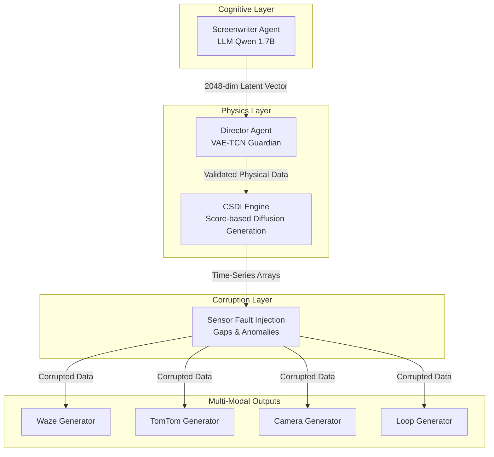
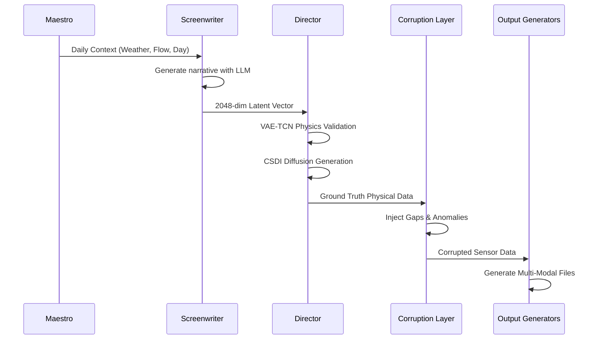

# SYNTHETIC

**An AI-Orchestrated Engine for Multi-Modal Traffic Scenario Synthesis**

---

## Overview

SYNTHETIC is an enterprise-grade synthetic data engine engineered to simulate high-fidelity, multi-modal traffic scenarios. Moving beyond deterministic simulations and static mathematical models, SYNTHETIC employs a Hybrid Generative AI Architecture that creates synergy between Large Language Models (LLM) for strategic planning and Conditional Score-based Diffusion Models (CSDI) for precise physical execution.

The system delivers strictly coherent and realistic datasets for Intelligent Transportation Systems (ITS) training, validation, and stress-testing.

---

## Purpose

SYNTHETIC was developed to address a critical gap in traffic simulation: the lack of realistic, multi-modal datasets that capture both the physical accuracy of ground truth data and the imperfections of real-world sensor observations.

| Challenge            | SYNTHETIC Solution                                           |
| -------------------- | ------------------------------------------------------------ |
| Deterministic Models | Generative AI architecture with non-linear behavior          |
| Single-Modal Data    | Synchronized multi-modal outputs (Waze, TomTom, Camera, Loop) |
| Perfect Sensor Data  | Configurable corruption layer (gaps, anomalies, noise)       |
| Static Scenarios     | LLM-driven dynamic narrative generation                      |
| Physics Violations   | VAE-TCN physics guardian validation                          |

---

## Architectural Philosophy

The core philosophy of SYNTHETIC is the strict separation between **Ground Truth Physics** and **Sensor Perception**.

In the real world, physics does not fail. Vehicles do not teleport, and inertia is never broken. However, the sensors observing these physics (cameras, GPS, inductive loops) fail constantly. SYNTHETIC models this reality by first generating a mathematically perfect physical simulation, then deliberately corrupting the observation of that simulation before saving the data.



---

## System Architecture

SYNTHETIC operates through a bi-cameral intelligence system with four specialized layers:

### Cognitive Layer

| Component          | Function                                                     | Technology     |
| ------------------ | ------------------------------------------------------------ | -------------- |
| Screenwriter Agent | Generates macro-level narrative context for each simulation day | Qwen 1.7B GGUF |
| Maestro            | Temporal orchestration and agent coordination                | Python Native  |

The Screenwriter operates from an omniscient perspective, reasoning about the entire city's traffic grid as a fluid dynamic system rather than individual driver behavior.

### Physics Layer

| Component      | Function                                                     | Technology        |
| -------------- | ------------------------------------------------------------ | ----------------- |
| Director Agent | Validates physics and translates vectors into time-series data | VAE-TCN + PyTorch |
| CSDI Engine    | Generates realistic flow and speed matrices                  | Score-based Diffusion |
| HyperTuner     | Just-in-time AutoML optimization                             | Optuna            |

The Director ensures all generated data respects physical constraints through VAE-TCN manifold projection with anomaly score calculation.

### Corruption Layer

| Fault Type | Probability        | Effect                                       |
| ---------- | ------------------ | -------------------------------------------- |
| Gaps       | 3-15% per timestep | Missing values (hardware dropout simulation) |
| Anomalies  | 3-5% per timestep  | Speed and flow multiplication (sensor noise) |

### Output Layer

| Generator        | Type              | Format | Simulates                                   |
| ---------------- | ----------------- | ------ | ------------------------------------------- |
| Waze Generator   | Global Navigation | JSON   | Crowdsourced GPS + ETA + Jam Levels         |
| TomTom Generator | Global Navigation | JSON   | Fleet commercial tracking + Flow Segment    |
| Camera Generator | Local Sensor      | JSON   | LPR/OCR visual detection + License Plates   |
| Loop Generator   | Local Sensor      | CSV    | Electromagnetic inductive loops + Occupancy |

---

## Data Generation Flow



---

## Traffic Flow Levels

SYNTHETIC operates in four distinct traffic density regimes:

| Level   | Base Amplitude | Free Flow Speed | Behavior                            |
| ------- | -------------- | --------------- | ----------------------------------- |
| Small   | 30 vehicles    | 80 km/h         | Low-density suburban traffic        |
| Medium  | 120 vehicles   | 70 km/h         | Standard urban traffic              |
| Large   | 250 vehicles   | 60 km/h         | High-density city traffic           |
| Chaotic | 600 vehicles   | 50 km/h         | 70-90% saturation, 3-15 km/h speeds |

The Chaotic mode is a special operating regime designed for stress-testing autonomous systems under extreme congestion conditions.

---

## Key Technical Features

| Feature              | Description                                                  |
| -------------------- | ------------------------------------------------------------ |
| Temporal Ground Zero | All simulations anchor to Monday 00:00:00 for weekly cyclical consistency |
| Temporal Inertia     | 70% new scenario + 30% previous state for day-to-day continuity |
| Physics Validation   | VAE-TCN calculates anomaly score and corrects physics violations |
| AutoML Just-in-Time  | TCN-VAE Guardian is automatically retuned for each new scenario via Optuna |
| Realistic Corruption | Configurable gaps (3-15%) and anomalies (3-5%) injected probabilistically |
| Multi-Modal Sync     | All outputs share the same base timestamp for fusion training |

---

## Output Structure

Generated data is organized in a hierarchical structure for easy ingestion by ML pipelines:

```
output/
└── YYYY-MM-DD_HH-MM-SS/
    ├── waze/
    │   └── waze_feed_*.json
    ├── tomtom/
    │   └── tomtom_flow_*.json
    ├── camera/
    │   ├── cam_01/
    │   │   └── cam_01_*.json
    │   └── cam_02/
    │       └── cam_02_*.json
    └── loop/
        ├── loop_01/
        │   └── loop_01_*.csv
        └── loop_02/
            └── loop_02_*.csv
```

Each sensor maintains its own dedicated folder, facilitating organized data ingestion and processing.

---

## System Requirements

| Component        | Minimum                     | Recommended                   |
| ---------------- | --------------------------- | ----------------------------- |
| Python           | 3.10+                       | 3.11+                         |
| RAM              | 8 GB                        | 16 GB+                        |
| Storage          | 5 GB free                   | 50 GB+ SSD                    |
| GPU              | Optional                    | NVIDIA 6GB+ VRAM (CUDA 11.8+) |
| Operating System | Windows 10/11, Linux, macOS | Windows 11 or Linux           |

---

## Usage

### Installation

1. Clone the repository
2. Create a Python virtual environment
3. Install dependencies via pip
4. Download the Qwen model (helper script included)

### Execution

SYNTHETIC includes a Tkinter-based graphical interface for configuration and execution:

1. Execute `generate_gui.py`
2. Select desired data sources (Waze, TomTom, Camera, Loop)
3. Configure problem injection (Gaps, Anomalies)
4. Define duration, interval, and flow level
5. Choose output directory
6. Click **GENERATE DATA**

The simulation runs in the background and notifies upon completion.

---

## Configuration Parameters

| Parameter  | Description                                  | Default    |
| ---------- | -------------------------------------------- | ---------- |
| Duration   | Simulation length in days                    | 1 day      |
| Interval   | Time between data points                     | 10 seconds |
| Flow Level | Traffic density (Small/Medium/Large/Chaotic) | Medium     |
| Gaps       | Enable sensor failure injection              | Enabled    |
| Anomalies  | Enable noise/anomaly injection               | Enabled    |
| Cameras    | Number of camera sensors                     | 5          |
| Loops      | Number of inductive loops                    | 5          |

---

## License

SYNTHETIC is distributed under the **MIT License**.

This software is intended as a research and testing tool for Intelligent Transportation Systems development. All components are licensed under MIT to facilitate academic and commercial research use.

---

## Contact

| Channel      | Details                                     |
| ------------ | ------------------------------------------- |
| Project Lead | Gabriel Moraes                              |
| Organization | Noxfort Systems                             |
| Email        | gabriel.moraes@noxfortsystems.com           |
| Website      | https://noxfortsystems.com                  |
| Issues       | GitHub Issues for bugs and feature requests |
| Discussions  | GitHub Discussions for questions and ideas  |

---

## About Noxfort Systems

Noxfort Systems is a deeptech company focused on AI-driven simulation infrastructure for critical urban systems. SYNTHETIC represents our commitment to delivering strictly coherent, realistic datasets for the Intelligent Transportation Systems ecosystem.

---

<div align="center">


[](https://opensource.org/licenses/MIT)
[](https://www.python.org/downloads/)
[](https://www.python.org/)

