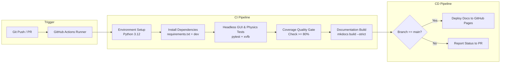

# 🔄 CI/CD Pipeline & GitHub Actions Automation

This document outlines the Continuous Integration (CI) and Continuous Deployment (CD) architecture designed for **SYNTHETIC**, including automated testing workflows, headless GUI test execution, documentation builds, and quality gates.

⬅️ [Documentation Hub](index.md) | 🏛️ [System Architecture](architecture.md) | 🧪 [Testing & QA Suite](testing.md) | ⚡ [API Reference](api_reference.md)

---

## 1. CI/CD Architecture Overview

SYNTHETIC utilizes an automated CI/CD pipeline built on **GitHub Actions** to guarantee that every commit and Pull Request on `main` complies with code quality, test pass rates, coverage thresholds, and documentation integrity.



---

## 2. Key Pipeline Stages

### Stage 1: Dependency Caching & Environment Provisioning
* **Runner OS:** `ubuntu-latest`
* **Python Version:** 3.12 (with support for matrix builds against 3.11)
* **Caching:** Uses `actions/cache@v4` on `~/.cache/pip` keyed by `requirements.txt` and `requirements-dev.txt` hashes to minimize build times.

### Stage 2: Headless Test Suite & Coverage Gate
* **Headless Display (`xvfb`):** The runner leverages `xvfb-run` (X Virtual Framebuffer) to execute Tkinter desktop UI tests headlessly without requiring a physical monitor or graphical window manager:
  ```bash
  xvfb-run -a .venv/bin/pytest -v --cov=src --cov=ui --cov=main tests/
  ```
* **Coverage Threshold Gate:** The CI runner enforces a minimum coverage threshold of **80%** (SYNTHETIC achieves **86%**). Any PR dropping below 80% coverage fails the pipeline:
  ```bash
  .venv/bin/pytest --cov=src --cov=ui --cov=main --cov-fail-under=80 tests/
  ```

### Stage 3: Strict Documentation Compilation
* Automatically compiles the entire documentation portal using MkDocs Material with `--strict` mode to prevent broken links, orphaned pages, or malformed YAML configs:
  ```bash
  .venv/bin/mkdocs build --strict
  ```

### Stage 4: Automated Documentation Deployment (CD)
* When code merges into `main`, GitHub Actions automatically pushes the compiled static HTML site from `site/` to the `gh-pages` branch using `mkdocs gh-deploy`.

---

## 3. GitHub Actions Workflow Configuration

To enable this pipeline in your repository, place the following workflow configuration in `.github/workflows/ci.yml`:

```yaml
name: SYNTHETIC CI/CD Pipeline

on:
  push:
    branches: [ main ]
  pull_request:
    branches: [ main ]

jobs:
  test-and-verify:
    name: Test, Coverage & Documentation Verification
    runs-on: ubuntu-latest

    steps:
      - name: Checkout Code
        uses: actions/checkout@v4

      - name: Set up Python 3.12
        uses: actions/setup-python@v5
        with:
          python-version: "3.12"
          cache: "pip"

      - name: Install System Dependencies for Headless GUI
        run: |
          sudo apt-get update
          sudo apt-get install -y xvfb python3-tk

      - name: Install Python Dependencies
        run: |
          python -m pip install --upgrade pip
          pip install -r requirements.txt
          pip install -r requirements-dev.txt
          pip install mkdocs mkdocs-material

      - name: Run Complete Test Suite with Coverage Gate (>= 80%)
        run: |
          xvfb-run -a pytest -v --cov=src --cov=ui --cov=main --cov-fail-under=80 tests/

      - name: Verify Documentation Build (Strict Mode)
        run: |
          mkdocs build --strict

  deploy-docs:
    name: Deploy Documentation to GitHub Pages
    needs: test-and-verify
    if: github.ref == 'refs/heads/main' && github.event_name == 'push'
    runs-on: ubuntu-latest
    permissions:
      contents: write

    steps:
      - name: Checkout Code
        uses: actions/checkout@v4

      - name: Set up Python
        uses: actions/setup-python@v5
        with:
          python-version: "3.12"

      - name: Install MkDocs & Material Theme
        run: |
          pip install mkdocs mkdocs-material

      - name: Deploy Docs to GitHub Pages
        run: |
          mkdocs gh-deploy --force
```

---

## 4. Quality Gates & Release Verification

1. **Deterministic Execution:** Tests run without network calls or physical GPU requirements.
2. **Warning Auditing:** Code changes must not emit deprecated API warnings (such as old PyTorch scaler calls).
3. **Artifact Isolation:** Generated output logs (`synthetic_slm.log`), `.coverage`, and `.pytest_cache` are strictly excluded from source control via `.gitignore`.

---

<div align="center">
  <br/>
  <b>Noxfort Systems</b> — <i>A State Of Art Company</i>
</div>
