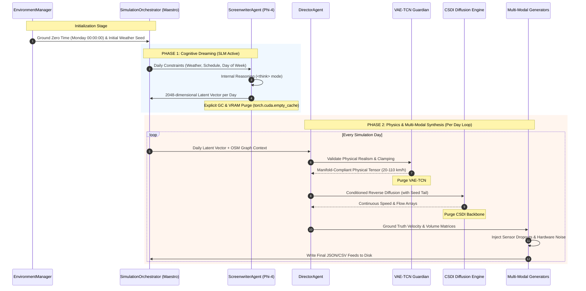

# 🏛️ SYNTHETIC: System Architecture & Execution Blueprint

This document specifies the technical architecture of **SYNTHETIC**, an enterprise AI-orchestrated engine designed for multi-modal traffic scenario synthesis. It outlines the two-phase generation pipeline, dynamic memory management, sequential lazy loading of deep neural networks, and the architectural separation between ground truth physics and sensor perception.

⬅️ [Documentation Hub](README.md) | 🧠 [Generative AI & Physics](generative_ai_and_physics.md) | 📡 [Multi-Modal Generators](multimodal_generators.md) | 🧪 [Testing Suite](testing.md)

---

## 1. High-Level Architectural Philosophy

SYNTHETIC addresses the limitations of deterministic traffic simulations by modeling the complex non-linear dynamics of real-world metropolitan networks. The architecture is built upon three foundational tenets:

1. **Strict Separation of Ground Truth and Perception:** Physical events (vehicle mass, velocity, acceleration, headway) obey immutable laws of motion. Sensors observing these events (GPS probes, inductive loops, ANPR cameras) suffer from physical noise, communication dropouts, and hardware anomalies. SYNTHETIC synthesizes perfect physics first, then explicitly applies realistic corruption layers.
2. **Sequential Resource Release (Zero Memory Waste):** Modern generative models (Phi-4 SLM, VAE-TCN, Score-based Diffusion, Graph Attention Networks) require substantial VRAM. The system enforces strict Sequential Lazy Loading: neural networks are loaded into GPU memory only when required and explicitly purged immediately after their execution stage.
3. **Single Responsibility Principle (SRP):** Cognitive reasoning is separated into the Screenwriter, physical boundary validation into the Director, spatial topology into GATv2, and temporal weather dynamics into the Markov Environment Manager.

---

## 2. The Two-Phase Generation Lifecycle

The simulation lifecycle is split into two asynchronous execution stages to optimize computational throughput and maintain memory limits under 6 GB VRAM:



### 2.1 Phase 1: The "Dreaming" Phase (Cognitive Layer)
* **Model:** Phi-4-mini Reasoning Model (Quantized GGUF format via `llama-cpp-python`).
* **Input:** Simulation parameters, calendar constraints, and the dynamic weather state provided by the `EnvironmentManager`.
* **Execution:**
  1. The Screenwriter prompt instructs the model to engage its internal thinking mode (`<think>...</think>`).
  2. The model reasons over traffic behavioral implications (e.g., severe rainfall causing speed reductions and increased headways).
  3. The internal hidden states of the transformer are projected into a **2048-dimensional latent vector** representing the daily macro-scenario.
* **Cleanup:** Once all simulation days are dreamed, the Phi-4 model is deleted from memory, and `gc.collect()` + `torch.cuda.empty_cache()` are executed before Phase 2 begins.

### 2.2 Phase 2: The "Physics & Synthesis" Phase (Per-Day Execution)
Operated by the `DirectorAgent`, Phase 2 iterates through each daily script, orchestrating three specialized neural modules sequentially:
1. **LightweightGATv2:** Extracts intersection node embeddings and arterial edge connectivity from the OpenStreetMap (`.osm`) or SUMO (`.net.xml`) network.
2. **VAE-TCN (Physics Guardian):** Validates the latent vector against a trained variational manifold of legal physical traffic states. Clamps speed distributions between 20 km/h and 110 km/h. If anomalous drift is detected, triggers Just-In-Time AutoML retuning (Optuna).
3. **CSDI Engine:** Conditional Score-based Diffusion model that synthesizes high-resolution time-series flow and speed curves conditioned on the validated latent tensor and spatial embeddings. Employs a `seed_tail` memory buffer from day $t-1$ to prevent inter-day continuity jumps.

---

## 3. Dynamic Memory Architecture

The table below illustrates the memory lifecycle across execution phases:

| Step | Component | Active In VRAM | Allocated VRAM | Action After Completion |
|:---:|:---|:---:|:---:|:---|
| **P1** | Phi-4-mini (GGUF Q6_K) | Yes | ~2,800 MB | Completely destroyed (`del self.llm`, `gc.collect()`) |
| **P2.1** | LightweightGATv2 | Yes | ~150 MB | Tensor extracted; graph model unloaded |
| **P2.2** | VAE-TCN Guardian | Yes | ~320 MB | Anomaly evaluated, speeds clamped; purged |
| **P2.3** | CSDI Diffusion Backbone | Yes | ~850 MB | Reverse SDE solved; backbone unloaded |
| **P2.4** | Multi-Modal Generators | CPU/RAM | ~45 MB RAM | JSON/CSV streaming to disk |

By guaranteeing that heavy neural components never coexist concurrently in memory, SYNTHETIC runs reliably on consumer-grade GPUs with 4 GB to 6 GB VRAM.

---

## 4. Subsystem Hierarchy & Directory Map

```text
SYNTHETIC/
├── src/
│   ├── agents/          # Orchestrating Agents (Director, Screenwriter)
│   ├── algorithms/      # Diffusion processes and SDE schedulers
│   ├── core/            # Environment, simulation logic, and map topology
│   ├── flow/            # Traffic flow strategies and mathematical invariants
│   ├── globalf/         # Global navigation generators (Waze, TomTom)
│   ├── localf/          # Local road sensor generators (Cameras, Loops)
│   ├── models/          # Deep learning models (Phi-4, VAE-TCN, CSDI, GATv2)
│   ├── optimizer/       # Optuna JIT HyperTuner and AutoML callbacks
│   ├── parsers/         # OpenStreetMap (.osm) and SUMO (.net.xml) parsers
│   └── services/        # ModelManager, SpatialService, PhysicsInterpreter
├── ui/                  # CustomTkinter GUI, TkinterMapView, and i18n
├── tests/               # 50 Pytest/Unittest validation test cases
└── docs/                # Multi-language documentation suite
```

---

<div align="center">
  <br/>
  <b>Noxfort Systems</b> — <i>A State Of Art Company</i>
</div>
