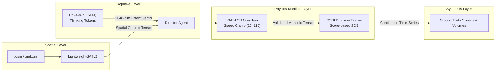

# 🧠 Generative AI, Physics Guardian & Diffusion Process

This document details the neural formulations, mathematical foundations, and deep learning architectures driving **SYNTHETIC**: the Small Language Model (SLM) cognitive screenwriter, the VAE-TCN Physics Guardian, the CSDI Conditional Score-based Diffusion Engine, and the Optuna Just-In-Time AutoML tuner.

⬅️ [Documentation Hub](README.md) | 🏛️ [System Architecture](architecture.md) | 📡 [Multi-Modal Generators](multimodal_generators.md) | 🗺️ [Spatial Topology](spatial_and_environment.md)

---

## 1. Hybrid Generative Pipeline Overview

Traffic scenario synthesis in SYNTHETIC is governed by a multi-tier neural framework:

---

## 2. Cognitive Layer: Screenwriter Agent (`src/agents/screenwriter.py`)

The **Screenwriter Agent** utilizes Microsoft's **Phi-4-mini** model via quantized GGUF execution (`llama-cpp-python`). Rather than relying on simple stochastic text generation, the agent is prompted into deep chain-of-thought reasoning (`<think>...</think>`).

### 2.1 The Latent Projection
1. The model ingests a structured prompt containing:
   - Dynamic weather state (e.g., *"Heavy rain with localized ponding"*).
   - Calendar constraints (e.g., *"Wednesday - Peak Morning Rush"*).
   - User flow intensity (e.g., *"Caótico - 600 vehicles base"*).
2. The model reasons through urban transit repercussions (incident likelihood, travel time inflation, lane capacity degradation).
3. The internal embedding states of the last transformer layer are pooled and projected into a dense **2048-dimensional continuous latent vector**:
   $$\mathbf{z}_{dream} \in \mathbb{R}^{2048}$$

---

## 3. Physics Guardian: VAE-TCN (`src/models/vae_tcn.py`)

Language models have no innate understanding of Newtonian kinematics or traffic fluid dynamics. The **VAE-TCN (Variational Autoencoder with Temporal Convolutional Networks)** acts as a symbolic-neural barrier ensuring physical plausibility.

### 3.1 Architecture & Temporal Convolutions
- **Encoder:** Dilated 1D causal convolutions that compress input trajectories without future leakage.
- **Variational Bottleneck:** Computes mean $\boldsymbol{\mu}$ and log-variance $\log \boldsymbol{\sigma}^2$ to project vectors onto a learned valid traffic manifold.
- **Decoder:** Transposed temporal convolutions reconstructing valid velocity and volume profiles.

### 3.2 Loss Function & Physics Penalties
The VAE-TCN is optimized using an augmented loss function that couples reconstruction error, Kullback-Leibler divergence, and hard physical constraints:

$$\mathcal{L} = \mathcal{L}_{recon} + \beta \mathcal{D}_{KL}(q_\phi(\mathbf{z}|\mathbf{x}) \parallel p(\mathbf{z})) + \lambda_{phys} \mathcal{L}_{physics}$$

Where the physical penalty enforces:
1. **Speed Clamping:** Restricts free-flow velocity to $v \in [20, 110] \text{ km/h}$.
2. **Kinematic Bounds:** Penalizes instantaneous vehicle teleportation and negative headway delays:
   $$\mathcal{L}_{physics} = \sum_{t} \max\left(0, v_{\min} - v_t\right)^2 + \max\left(0, v_t - v_{\max}\right)^2 + \left| \frac{\partial v}{\partial t} \right|_{> a_{\max}}$$

### 3.3 Temporal Inertia
To maintain day-to-day realism across multi-day runs, the Director blends the current day's vector with the previous day:
$$\mathbf{z}_{effective}^{(t)} = 0.70 \cdot \mathbf{z}_{dream}^{(t)} + 0.30 \cdot \mathbf{z}_{effective}^{(t-1)}$$

---

## 4. Conditional Score-Based Diffusion: CSDI Engine (`src/models/csdi_engine.py`)

High-frequency time-series curves (speeds and traffic counts) are generated using **CSDI (Conditional Score-based Diffusion Models for Imputation and Synthesis)**.

### 4.1 Forward and Reverse Diffusion
1. **Forward Process (Noise Injection):** Adds Gaussian perturbation over $T$ timesteps according to a cosine variance schedule $\beta_1, \dots, \beta_T$:
   $$q(\mathbf{x}_t \mid \mathbf{x}_{t-1}) = \mathcal{N}\left(\mathbf{x}_t; \sqrt{1 - \beta_t}\mathbf{x}_{t-1}, \beta_t \mathbf{I}\right)$$
2. **Reverse Process (Conditional Denoising):** A deep bidirectional dilated convolutional backbone predicts the added score conditioned on the validated vector $\mathbf{z}$ and spatial topology context $\mathbf{g}$:
   $$p_\theta(\mathbf{x}_{t-1} \mid \mathbf{x}_t, \mathbf{z}, \mathbf{g}) = \mathcal{N}\left(\mathbf{x}_{t-1}; \boldsymbol{\mu}_\theta(\mathbf{x}_t, t \mid \mathbf{z}, \mathbf{g}), \boldsymbol{\Sigma}_\theta(\mathbf{x}_t, t)\right)$$

### 4.2 Seed Tail for Seamless Multi-Day Boundaries
To prevent disjoint steps between consecutive days, the CSDI engine saves the final 2 hours of day $t-1$ as a `seed_tail`. During the synthesis of day $t$, this tail is injected into the initial conditions of the reverse diffusion sampler.

---

## 5. Just-In-Time AutoML Tuner (`src/optimizer/tuner.py`)

When the VAE-TCN calculates an anomaly score $> 1.00$ (indicating that the Screenwriter dreamed a novel, unseen extreme condition such as a blizzard combined with catastrophic flow), an **Optuna-driven Bayesian optimization study** is dynamically spawned.

* **Exploration Space:**
  - `n_tcn_layers`: 2 to 4
  - `tcn_base_channels`: 16, 32, 64
  - `learning_rate`: $1\times 10^{-4}$ to $1\times 10^{-2}$
  - `beta` (KL weight): 0.5 to 2.5
  - `lambda_physics`: 0.1 to 1.0
  - CSDI `residual_channels`: 64, 96, 128
  - CSDI `diffusion_steps`: 20 to 100
* **Early Stopping Callback:** Terminates trials early when performance stagnates for 2 consecutive evaluations, completing full adaptation in seconds without stalling the user interface.

---

   
  <b>Noxfort Systems</b> — <i>A State Of Art Company</i>

