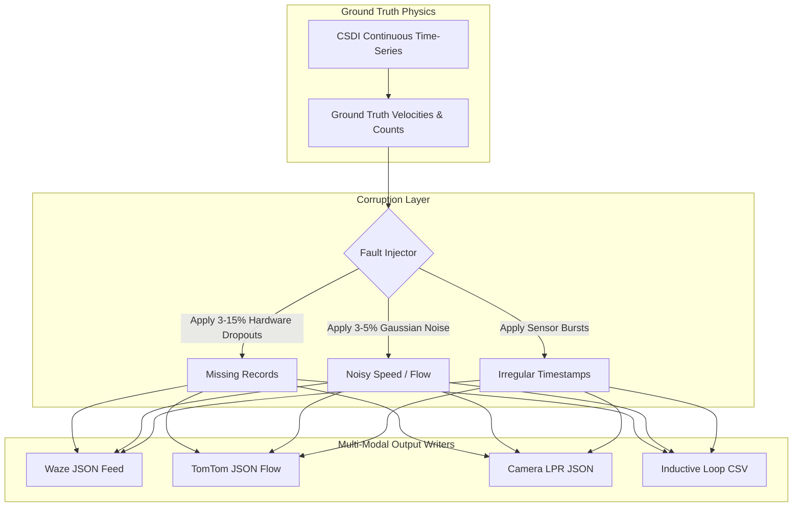

# 📡 Multi-Modal Generators & Sensor Corruption Layer

This document provides the technical specification for all output data generators in **SYNTHETIC**, detailing data schemas, physical modeling parameters, the sensor corruption pipeline, and the output filesystem hierarchy.

⬅️ [Documentation Hub](README.md) | 🏛️ [System Architecture](architecture.md) | 🧠 [Generative AI & Physics](generative_ai_and_physics.md) | 🗺️ [Spatial Topology](spatial_and_environment.md)

---

## 1. Single Responsibility: Physics vs. Perception

A fundamental tenet of SYNTHETIC is that **physics is continuous and deterministic, while perception is discrete and noisy**. 



---

## 2. Generator Specifications

### 2.1 Waze Traffic Feed Generator (`src/globalf/waze_generator.py`)
Simulates community crowdsourced GPS navigation events, alerting to slow traffic, jams, hazards, and construction.

* **Format:** JSON (`waze_feed_YYYYMMDD_HHMMSS.json`)
* **Key Fields:**
  ```json
  {
    "alerts": [
      {
        "id": "waze_alert_40219",
        "uuid": "a7b3c990-12df-498c-8fbb-71289cf12019",
        "type": "JAM",
        "subtype": "JAM_HEAVY_TRAFFIC",
        "location": { "x": -51.16958, "y": -23.30445 },
        "street": "Avenida Higienópolis",
        "city": "Londrina",
        "confidence": 4,
        "reliability": 8,
        "reportRating": 3,
        "pubMillis": 1727584800000
      }
    ],
    "jams": [
      {
        "id": "waze_jam_88412",
        "speedKMH": 14.2,
        "freeFlowSpeedKMH": 60.0,
        "delaySeconds": 240,
        "lengthMeters": 850.0,
        "level": 4,
        "line": [
          { "x": -51.16958, "y": -23.30445 },
          { "x": -51.17120, "y": -23.30610 }
        ]
      }
    ]
  }
  ```

### 2.2 TomTom Flow Segment Generator (`src/globalf/tomtom_generator.py`)
Simulates commercial fleet tracking telemetry, segment speeds, travel times, and Functional Road Class (FRC) breakdowns.

* **Format:** JSON (`tomtom_flow_YYYYMMDD_HHMMSS.json`)
* **Key Fields:**
  ```json
  {
    "flowSegmentData": {
      "frc": "FRC1",
      "currentSpeed": 38.4,
      "freeFlowSpeed": 60.0,
      "currentTravelTime": 142,
      "freeFlowTravelTime": 90,
      "confidence": 0.94,
      "roadClosure": false,
      "coordinates": {
        "coordinate": [
          { "latitude": -23.30445, "longitude": -51.16958 },
          { "latitude": -23.30610, "longitude": -51.17120 }
        ]
      }
    }
  }
  ```

### 2.3 Optical Camera / ANPR Generator (`src/localf/camera_generator.py`)
Simulates edge-computing video analytics cameras executing Automatic Number Plate Recognition (ANPR/LPR) and vehicle classification.

* **Format:** JSON (`cam_XX_YYYYMMDD_HHMMSS.json`)
* **Key Fields:**
  ```json
  {
    "sensor_id": "CAM_HIGIENOPOLIS_01",
    "timestamp": "2026-09-29T08:15:30.124Z",
    "detections": [
      {
        "vehicle_id": "VEH_99214",
        "plate": "BRA2E19",
        "plate_confidence": 0.982,
        "classification": "CAR",
        "lane": 2,
        "instantaneous_speed_kmh": 46.8,
        "bounding_box": { "x": 120, "y": 340, "w": 280, "h": 190 }
      }
    ]
  }
  ```

### 2.4 Inductive Loop Detector Generator (`src/localf/loop_generator.py`)
Simulates electromagnetic roadway sensors embedded below asphalt lanes.

* **Format:** CSV (`loop_XX_YYYYMMDD_HHMMSS.csv`)
* **Structure:**
  ```csv
  timestamp,detector_id,lane,vehicle_count,occupancy_percent,avg_speed_kmh,status
  2026-09-29 08:00:00,LOOP_01,1,14,18.4,52.1,NORMAL
  2026-09-29 08:01:00,LOOP_01,1,19,26.8,44.3,NORMAL
  2026-09-29 08:02:00,LOOP_01,1,0,0.0,0.0,DROPOUT
  ```

---

## 3. Sensor Corruption & Fault Injection Engine

When enabled in the GUI, the corruption engine executes before serializing data to disk:
1. **Hardware Dropouts (3% - 15%):** Random packet drops mimicking telemetry transmission failures in cellular/Ethernet infrastructure.
2. **Sensor Gaps & Burst Anomalies:** Consecutive missing intervals where physical detection is silenced for several minutes.
3. **Measurement Noise (3% - 5%):** Gaussian jitter added to continuous metrics:
   $$v_{observed} = v_{true} \cdot \left(1 + \mathcal{N}\left(0, \sigma^2\right)\right), \quad \sigma \in [0.03, 0.05]$$

---

## 4. Output Storage Hierarchy

Generated artifacts are automatically structured by timestamp:

```text
output/
└── 2026-09-29_08-00-00/
    ├── metadata.json
    ├── waze/
    │   ├── waze_feed_20260929_080000.json
    │   └── ...
    ├── tomtom/
    │   ├── tomtom_flow_20260929_080000.json
    │   └── ...
    ├── camera/
    │   ├── CAM_01/
    │   │   └── cam_01_20260929_080000.json
    │   └── CAM_02/
    │       └── cam_02_20260929_080000.json
    └── loop/
        ├── LOOP_01/
        │   └── loop_01_20260929.csv
        └── LOOP_02/
            └── loop_02_20260929.csv
```

---

<div align="center">
  <br/>
  <b>Noxfort Systems</b> — <i>A State Of Art Company</i>
</div>
