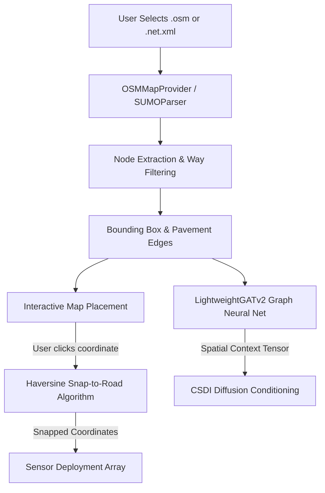
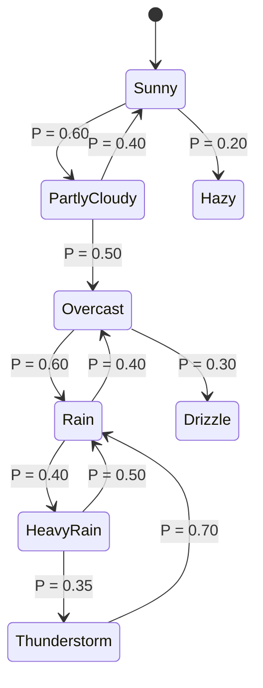

# 🗺️ Spatial Topology & Meteorological Environment Engine

This document specifies the spatial mapping mechanisms, OpenStreetMap/SUMO network parsers, the Haversine Snap-to-Road projection, and the Markov-chain meteorological engine governing **SYNTHETIC**.

⬅️ [Documentation Hub](README.md) | 🏛️ [System Architecture](architecture.md) | 🧠 [Generative AI & Physics](generative_ai_and_physics.md) | 🖥️ [Desktop UI](ui_and_localization.md)

---

## 1. Spatial Topology Architecture

Unlike legacy simulations that generate synthetic data along arbitrary, static coordinate lines, SYNTHETIC anchors all scenario generation into authentic geospatial networks.



---

## 2. Ingestion & Graph Parsing (`src/parsers/`)

### 2.1 OpenStreetMap (`.osm`, `.osm.gz`)
The parser (`src/parsers/osm.py`) reads raw XML and filters tags strictly relevant to vehicular transit:
* **Node Extraction:** Collects all `<node id="..." lat="..." lon="...">` entities into high-speed spatial lookup arrays.
* **Way Filtering:** Isolates `<way>` elements containing the `highway` tag:
  - Allowed classifications: `motorway`, `trunk`, `primary`, `secondary`, `tertiary`, `residential`.
  - Discarded categories: `footway`, `pedestrian`, `cycleway`, `steps`, `service`.
* **Bounding Box Calculation:** Automatically computes $(\text{lat}_{\min}, \text{lon}_{\min}, \text{lat}_{\max}, \text{lon}_{\max})$ to center the GUI map widget and constrain generative bounds.

### 2.2 SUMO Networks (`.net.xml`, `.net.xml.gz`)
The SUMO parser (`src/parsers/sumo.py`) extracts junction nodes and edge definitions, converting lane geometry coordinates using `pyproj` Cartesian-to-WGS84 transformations.

---

## 3. Mathematical "Snap-to-Road" Mechanism

When placing cameras or inductive loops on the GUI map, human clicks are physically inexact. The `OSMMapProvider` snaps the raw cursor coordinate $(\phi_{click}, \lambda_{click})$ to the closest valid highway edge segment $[(\phi_A, \lambda_A), (\phi_B, \lambda_B)]$ using the Haversine metric:

$$d = 2R \arcsin \left( \sqrt{\sin^2\left(\frac{\Delta \phi}{2}\right) + \cos(\phi_1)\cos(\phi_2)\sin^2\left(\frac{\Delta \lambda}{2}\right)} \right)$$

The projection finds the scalar parameter $t^* \in [0, 1]$ that minimizes the perpendicular distance from the click point to the segment, snapping the sensor coordinate directly onto the asphalt surface:

$$\mathbf{p}_{snapped} = \mathbf{p}_A + t^* (\mathbf{p}_B - \mathbf{p}_A)$$

---

## 4. Graph Attention Extraction (`LightweightGATv2`)

The continuous road network is mapped to a PyTorch Geometric graph $\mathcal{G} = (\mathcal{V}, \mathcal{E})$. The **LightweightGATv2** model computes dynamic spatial attention coefficients $\alpha_{ij}$:

$$\alpha_{ij} = \frac{\exp\left(\mathbf{a}^\top \text{LeakyReLU}\left(\mathbf{W} \cdot [\mathbf{h}_i \parallel \mathbf{h}_j]\right)\right)}{\sum_{k \in \mathcal{N}_i} \exp\left(\mathbf{a}^\top \text{LeakyReLU}\left(\mathbf{W} \cdot [\mathbf{h}_i \parallel \mathbf{h}_k]\right)\right)}$$

The aggregated spatial context tensor informs the CSDI diffusion model whether a given road segment is a bottleneck intersection or an open arterial road.

---

## 5. Meteorological Engine & Markov Chains (`src/core/environment.py`)

Physical weather does not transition randomly from clear skies to severe hail without transitional states. SYNTHETIC governs atmospheric evolution through a data-driven **Markov-chain state machine** defined in `config/weather_rules.json`.

### 5.1 Weather Transitions


### 5.2 The Triple-Tuple Semantic Format
When sampled, the environment produces a descriptive tuple formatted as:
1. **Condition:** Base weather state (e.g., `Rain`).
2. **Intensity:** Derived severity (e.g., `Heavy`).
3. **Characteristic:** Physical impact on friction/visibility (e.g., `with standing water and reduced traction`).

This composite text is fed into the Phi-4-mini Screenwriter prompt, mathematically informing the latent vector that physical speeds must drop and braking distances must increase.

---

## 6. Temporal Ground Zero Synchronization

To guarantee that generated time-series data captures the natural weekly cycles of urban mobility (weekday morning rush, midday valleys, evening peaks, and weekend relaxations), all simulations anchor to **Ground Zero Time**:

$$\text{Ground Zero} = \text{Next Monday at } 00:00:00$$

Calculated via:
```python
def get_next_monday_midnight(base_date: datetime) -> datetime:
    days_ahead = 7 - base_date.weekday()
    if days_ahead <= 0:
        days_ahead += 7
    target = base_date + timedelta(days=days_ahead)
    return target.replace(hour=0, minute=0, second=0, microsecond=0)
```

This prevents artificial discontinuities and provides standard 7-day cyclical periods for deep reinforcement learning and model benchmarking.

---

<div align="center">
  <br/>
  <b>Noxfort Systems</b> — <i>A State Of Art Company</i>
</div>
