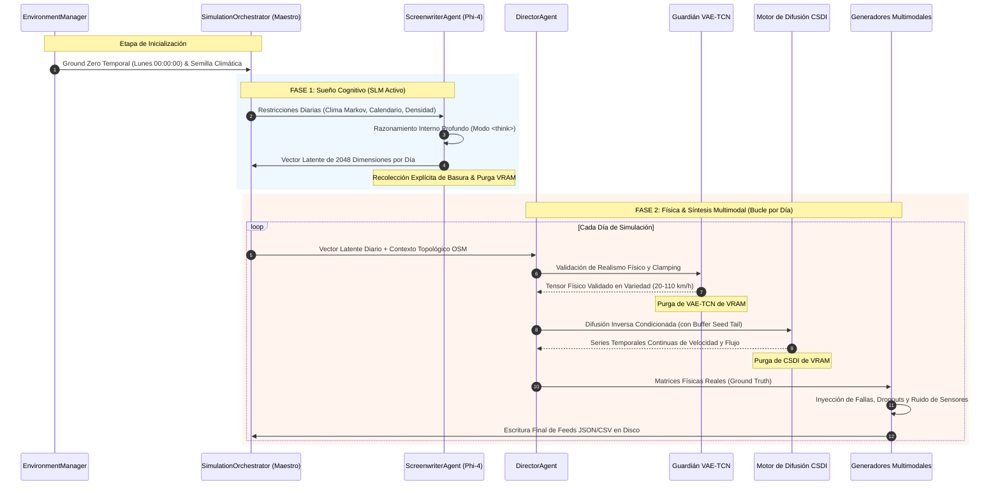

# 🏛️ SYNTHETIC: Arquitectura del Sistema y Blueprint de Ejecución

Este documento especifica la arquitectura técnica del ecosistema **SYNTHETIC**, motor corporativo de IA generativa diseñado para la síntesis de escenarios de tráfico multimodal urbano de alta fidelidad. Detalla el pipeline en dos fases, la gestión dinámica de memoria mediante carga secuencial bajo demanda (Lazy Loading) y la separación estricta entre leyes físicas y percepción sensorial.

⬅️ [Centro de Documentación](README.md) | 🧠 [IA Generativa y Física](generative_ai_and_physics.md) | 📡 [Generadores Multimodales](multimodal_generators.md) | 🧪 [Pruebas y QA](testing.md)

---

## 1. Filosofía de Arquitectura y Principios

1. **Separación Estricta entre Física Real y Percepción Sensorial:** En el mundo físico, las leyes de la cinemática no fallan. Los vehículos no se teletransportan y la inercia se respeta. Sin embargo, los sensores (sondas GPS, espiras inductivas, cámaras) fallan constantemente debido a ruido electromagnético, pérdidas de red y anomalías. SYNTHETIC sintetiza primero una simulación física matemáticamente exacta y luego inyecta deliberadamente una capa realista de corrupción sensorial.
2. **Liberación Secuencial de Recursos (Cero Desperdicio de VRAM):** Redes de gran escala (Phi-4 SLM, VAE-TCN, Difusión CSDI, GATv2) nunca coexisten en la memoria GPU. Cada modelo se carga exclusivamente durante su fase de inferencia y se purga de inmediato mediante `gc.collect()` y limpieza de caché CUDA.
3. **Principio de Responsabilidad Única (SRP):** El razonamiento cognitivo se delega al Guionista (Screenwriter), la validación de límites físicos al Director, la topología urbana a GATv2 y la dinámica meteorológica al motor de Markov.

---

## 2. Ciclo de Vida de Generación en Dos Fases

---

   
  <b>Noxfort Systems</b> — <i>A State Of Art Company</i>

