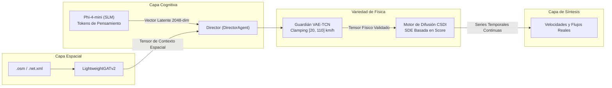

# 🧠 IA Generativa, Guardián de Física y Proceso de Difusión

Este documento detalla las formulaciones neuronales, los fundamentos matemáticos y las arquitecturas de aprendizaje profundo de **SYNTHETIC**: el modelo de lenguaje local Phi-4-mini, el Guardián de Física VAE-TCN, el motor de difusión condicional por puntuación (CSDI) y el optimizador AutoML con Optuna.

⬅️ [Centro de Documentación](README.md) | 🏛️ [Arquitectura del Sistema](architecture.md) | 📡 [Generadores Multimodales](multimodal_generators.md) | 🗺️ [Topología Espacial](spatial_and_environment.md)

---

## 1. Visión General del Pipeline Neuronal Híbrido

---

## 2. Capa Cognitiva: Agente Guionista (`src/agents/screenwriter.py`)

El **ScreenwriterAgent** opera el modelo **Phi-4-mini** en formato GGUF cuantizado a través de `llama-cpp-python`. El modelo es inducido a razonar paso a paso en modo de pensamiento (`<think>...</think>`).

### 2.1 Proyección Latente
1. Procesa variables de clima dinámico, calendario y régimen de densidad de tráfico.
2. Razona sobre repercusiones viales (accidentes, disminución de velocidad de flujo libre).
3. Los estados ocultos de la última capa del transformador se proyectan en un **vector latente continuo de 2048 dimensiones**:
   $$\mathbf{z}_{dream} \in \mathbb{R}^{2048}$$

---

## 3. Guardián de Física: VAE-TCN (`src/models/vae_tcn.py`)

El **VAE-TCN (Autoencoder Variacional con Convoluciones Temporales)** actúa como salvaguarda física:
* **Función de Pérdida con Penalización:** Combina error de reconstrucción, divergencia KL y términos de barrera física $\mathcal{L}_{physics}$, prohibiendo velocidades negativas y forzando $v \in [20, 110]\text{ km/h}$.
* **Inercia Temporal:** Combina el vector latente diario con el del día previo para garantizar transiciones suaves:
  $$\mathbf{z}_{efectivo}^{(t)} = 0{,}70 \cdot \mathbf{z}_{dream}^{(t)} + 0{,}30 \cdot \mathbf{z}_{efectivo}^{(t-1)}$$

---

## 4. Difusión Condicional por Puntuación: CSDI (`src/models/csdi_engine.py`)

Genera las series temporales de flujo y velocidad mediante ecuaciones diferenciales estocásticas inversas condicionadas en $\mathbf{z}$ y $\mathbf{g}$. El buffer `seed_tail` asegura una transición continua entre días consecutivos a medianoche.

---

## 5. Optimizador AutoML Just-In-Time con Optuna (`src/optimizer/tuner.py`)

Si se detecta una anomalía física severa ($> 1{,}00$), el sistema inicia automáticamente un estudio bayesiano con **Optuna** en segundo plano, recalculando parámetros de la TCN y CSDI sin bloquear la interfaz de usuario.

---

   
  <b>Noxfort Systems</b> — <i>A State Of Art Company</i>

