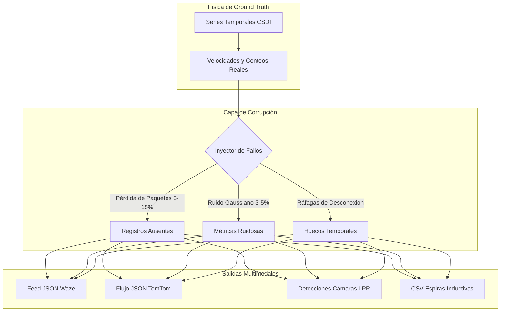

# 📡 Generadores Multimodales y Capa de Corrupción de Sensores

Este documento proporciona las especificaciones técnicas de todos los generadores de datos de **SYNTHETIC**, detallando esquemas de salida, modelos de fallos y jerarquía en disco.

⬅️ [Centro de Documentación](README.md) | 🏛️ [Arquitectura del Sistema](architecture.md) | 🧠 [IA Generativa y Física](generative_ai_and_physics.md) | 🗺️ [Topología Espacial](spatial_and_environment.md)

---

## 1. Separación de Responsabilidades: Física vs. Percepción

En SYNTHETIC, **la física es continua e inviolable, mientras que la percepción sensorial es discreta y sujeta a ruido**:

---

## 2. Especificación de Formatos

* **Waze (`src/globalf/waze_generator.py`):** Simula reportes de tráfico comunitario GPS (retenciones, incidentes) en formato JSON (`waze_feed_*.json`).
* **TomTom (`src/globalf/tomtom_generator.py`):** Simula telemetría de flotas y velocidades por clase funcional de vía (FRC1 a FRC6) en JSON (`tomtom_flow_*.json`).
* **Cámaras ANPR/LPR (`src/localf/camera_generator.py`):** Simula cámaras de control vial con lectura sintética de matrículas vehiculares en JSON (`cam_*_*.json`).
* **Espiras Inductivas (`src/localf/loop_generator.py`):** Simula detectores electromagnéticos bajo el pavimento (conteos y porcentaje de ocupación) en formato CSV (`loop_*_*.csv`).

---

## 3. Capa de Inyección de Fallos y Ruido

1. **Dropouts de Hardware (3% a 15%):** Supresión aleatoria de paquetes de telemetría.
2. **Ráfagas de Pérdida de Datos:** Ausencia total de mediciones durante varios minutos.
3. **Ruido Gaussiano (3% a 5%):** Jitter multiplicativo sobre velocidades y volúmenes:
   $$v_{observado} = v_{real} \cdot \left(1 + \mathcal{N}\left(0, \sigma^2\right)\right), \quad \sigma \in [0{,}03; 0{,}05]$$

---

   
  <b>Noxfort Systems</b> — <i>A State Of Art Company</i>

