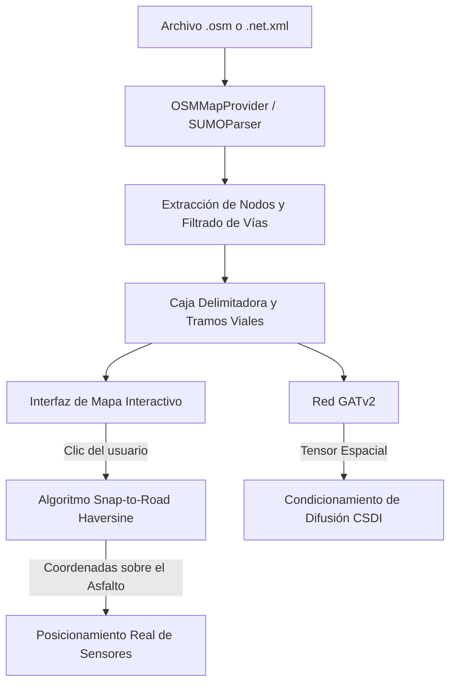

# 🗺️ Topología Espacial y Motor Meteorológico de Markov

Este documento especifica los mecanismos de ingesta de redes OpenStreetMap y SUMO, la proyección Snap-to-Road mediante la fórmula de Haversine y el motor meteorológico de Markov de **SYNTHETIC**.

⬅️ [Centro de Documentación](README.md) | 🏛️ [Arquitetura del Sistema](architecture.md) | 🧠 [IA Generativa y Física](generative_ai_and_physics.md) | 🖥️ [Interfaz Desktop](ui_and_localization.md)

---

## 1. Topología Espacial y Consciencia Geográfica

SYNTHETIC fundamenta la síntesis de datos en redes geográficas reales:

---

## 2. Proyección Matemática "Snap-to-Road"

La función `snap_to_road` calcula la distancia ortodrómica mínima mediante Haversine entre el clic del usuario $(\phi, \lambda)$ y los segmentos de carretera habilitados, proyectando el sensor directamente sobre la superficie del pavimento.

---

## 3. Dinámica Meteorológica por Cadena de Markov

La meteorología evoluciona mediante una **cadena de Markov** discreta (`config/weather_rules.json`):
* Transiciones realistas: Despejado $\to$ Parcialmente Nublado $\to$ Lluvia $\to$ Tormenta $\to$ Lluvia Moderada.
* Se genera una tupla semántica `(Condición, Intensidad, Característica)` que se traduce e inyecta en el prompt del modelo Phi-4-mini.

---

## 4. Ground Zero Temporal (Sincronización Semanal)

Todas las simulaciones comienzan en el **Lunes inmediato a las 00:00:00**, reproduciendo los ciclos de congestión laboral y de fin de semana.

---

   
  <b>Noxfort Systems</b> — <i>A State Of Art Company</i>

