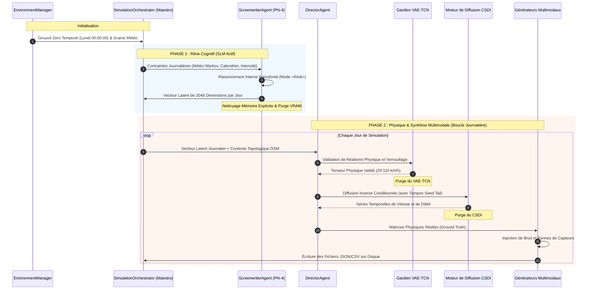

# 🏛️ SYNTHETIC: Architecture Système et Modèle d'Exécution

Ce document décrit l'architecture technique du système **SYNTHETIC**, moteur d'IA générative conçu pour la synthèse de scénarios de trafic multimodal urbain. Il détaille le pipeline en deux étapes, la gestion dynamique de la mémoire par chargement séquentiel à la demande (Lazy Loading) et l'isolation stricte entre physique fondamentale et perception des capteurs.

⬅️ [Hub de Documentation](README.md) | 🧠 [IA Générative et Physique](generative_ai_and_physics.md) | 📡 [Générateurs Multimodaux](multimodal_generators.md) | 🧪 [Tests et QA](testing.md)

---

## 1. Philosophie d'Architecture et Principes Fondamentaux

1. **Séparation Stricte entre Physique Fondamentale et Perception :** Dans le monde réel, les lois de la physique ne faiblissent jamais. Les véhicules obéissent aux règles cinématiques. En revanche, les capteurs (balises GPS, boucles électromagnétiques, caméras LPR) subissent des pannes récurrentes, des bruits de mesure et des pertes de paquets. SYNTHETIC génère d'abord une simulation physique parfaite, puis applique délibérément une couche de corruption réaliste.
2. **Libération Séquentielle des Ressources (Zéro Gaspillage VRAM) :** Les réseaux de neurones volumineux (SLM Phi-4, VAE-TCN, Diffusion CSDI, GATv2) ne coexistent jamais simultanément en mémoire GPU. Chaque réseau n'est chargé que pour son étape dédiée et est immédiatement détruit via `gc.collect()` et vidage du cache CUDA.
3. **Principe de Responsabilité Unique (SRP) :** La scénarisation cognitive est déléguée au Screenwriter, la vérification des limites physiques au Director, la topologie spatiale au GATv2 et les évolutions atmosphériques au gestionnaire de Markov.

---

## 2. Cycle de Vie de Génération en Deux Phases

---

   
  <b>Noxfort Systems</b> — <i>A State Of Art Company</i>

