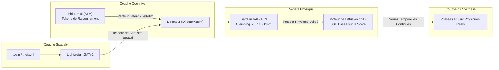

# 🧠 IA Générative, Gardien de Physique et Processus de Diffusion

Ce document détaille les formulations neuronales, les fondements mathématiques et les architectures d'apprentissage profond du moteur **SYNTHETIC** : le petit modèle de langage (SLM) Phi-4-mini, le Gardien de Physique VAE-TCN, le moteur de diffusion conditionnelle CSDI et le réglage automatique d'hyperparamètres (AutoML) avec Optuna.

⬅️ [Hub de Documentation](README.md) | 🏛️ [Architecture Système](architecture.md) | 📡 [Générateurs Multimodaux](multimodal_generators.md) | 🗺️ [Topologie Spatiale](spatial_and_environment.md)

---

## 1. Vue d'Ensemble du Pipeline Neuronal Hybride

La synthèse de scénarios dans SYNTHETIC repose sur une coordination multi-couches :

---

## 2. Couche Cognitive : Agent Scénariste (`src/agents/screenwriter.py`)

Le **ScreenwriterAgent** utilise le modèle compact **Phi-4-mini** au format quantifié GGUF via `llama-cpp-python`. Le modèle est guidé pour produire un raisonnement explicite pas à pas (`<think>...</think>`).

### 2.1 Projection Latente
1. Reçoit le contexte météorologique dynamique, les contraintes calendaires et le niveau d'intensité de trafic.
2. Raisonne sur la dégradation des capacités routières et la hausse des temps de parcours.
3. Les états cachés de la dernière couche du transformer sont projetés dans un **vecteur latent continu de 2048 dimensions** :
   $$\mathbf{z}_{dream} \in \mathbb{R}^{2048}$$

---

## 3. Gardien de Physique : VAE-TCN (`src/models/vae_tcn.py`)

Les modèles de langage purs n'ont pas de compréhension intrinsèque des lois cinématiques. Le **VAE-TCN (Auto-encodeur Variationnel à Convolutions Temporelles)** agit comme une barrière neuro-symbolique assurant la plausibilité physique.

### 3.1 Fonction de Perte et Pénalités Physiques
L'entraînement du VAE-TCN combine l'erreur de reconstruction, la divergence de Kullback-Leibler et des pénalités physiques strictes :

$$\mathcal{L} = \mathcal{L}_{recon} + \beta \mathcal{D}_{KL}(q_\phi(\mathbf{z}|\mathbf{x}) \parallel p(\mathbf{z})) + \lambda_{phys} \mathcal{L}_{physics}$$

Où $\mathcal{L}_{physics}$ interdit formellement les vitesses négatives, les téléportations de véhicules et impose un intervalle de vitesse valide $v \in [20, 110] \text{ km/h}$.

### 3.2 Inertie Temporelle
Pour préserver la continuité entre jours consécutifs, le Directeur combine le vecteur latent du jour présent avec celui du jour précédent :
$$\mathbf{z}_{effectif}^{(t)} = 0{,}70 \cdot \mathbf{z}_{dream}^{(t)} + 0{,}30 \cdot \mathbf{z}_{effectif}^{(t-1)}$$

---

## 4. Diffusion Conditionnelle par Score : CSDI (`src/models/csdi_engine.py`)

Les courbes temporelles de vitesse et de volume sont générées par des **Modèles de Diffusion Conditionnelle Basés sur le Score (CSDI)**.
* **Processus Inverse :** Une architecture convolutive temporelle bidirectionnelle débruite progressivement le signal conditionné sur le vecteur $\mathbf{z}$ et les tenseurs de graphe $\mathbf{g}$.
* **Tampon Seed Tail :** Conserve les 2 dernières heures du jour $t-1$ pour amorcer le jour $t$, éliminant tout saut abrupt à minuit.

---

## 5. Optimiseur AutoML Just-In-Time avec Optuna (`src/optimizer/tuner.py`)

Lorsqu'une anomalie physique sévère ($> 1{,}00$) est détectée, SYNTHETIC lance automatiquement une étude d'optimisation bayésienne en arrière-plan avec **Optuna**, réajustant les canaux TCN, le taux d'apprentissage et les étapes de diffusion en quelques secondes.

---

   
  <b>Noxfort Systems</b> — <i>A State Of Art Company</i>

