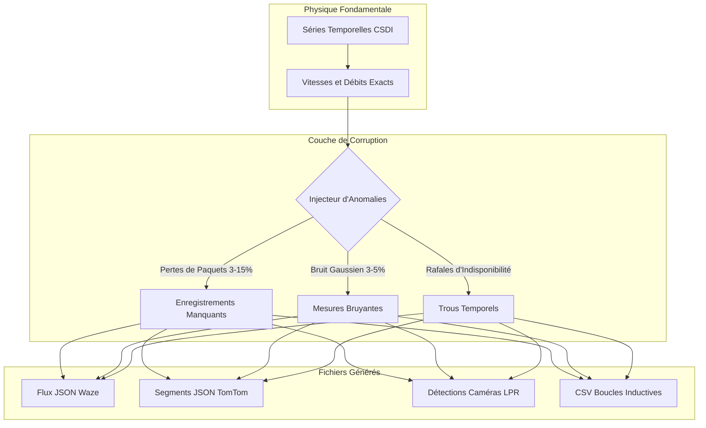

# 📡 Générateurs Multimodaux et Couche de Corruption des Capteurs

Ce document fournit les spécifications techniques de l'ensemble des générateurs de données de **SYNTHETIC**, incluant les schémas de sortie, les modèles de pannes et l'arborescence du système de fichiers.

⬅️ [Hub de Documentation](README.md) | 🏛️ [Architecture Système](architecture.md) | 🧠 [IA Générative et Physique](generative_ai_and_physics.md) | 🗺️ [Topologie Spatiale](spatial_and_environment.md)

---

## 1. Séparation des Responsabilités : Physique vs. Perception

Dans SYNTHETIC, **la physique est continue et sans faille, tandis que les observations des capteurs sont discrètes et sujettes aux pannes** :

---

## 2. Spécifications des Formats de Sortie

* **Générateur Waze (`src/globalf/waze_generator.py`) :** Simule les alertes communautaires GPS (embouteillages, accidents, ralentissements) au format JSON (`waze_feed_*.json`).
* **Générateur TomTom (`src/globalf/tomtom_generator.py`) :** Simule les données de télématique de flottes et les temps de parcours par classe fonctionnelle (FRC1 à FRC6) au format JSON (`tomtom_flow_*.json`).
* **Générateur de Caméras LPR/ANPR (`src/localf/camera_generator.py`) :** Simule des caméras intelligentes avec reconnaissance optique de plaques minéralogiques synthétiques au format JSON (`cam_*_*.json`).
* **Générateur de Boucles Inductives (`src/localf/loop_generator.py`) :** Simule les compteurs électromagnétiques intégrés dans la chaussée (taux d'occupation et comptages par voie) au format CSV (`loop_*_*.csv`).

---

## 3. Couche d'Injection de Pannes et Bruit

Lorsque activée dans l'interface, la couche de corruption applique :
1. **Pertes de Paquets (3% à 15%) :** Suppressions aléatoires de données simulant des pannes de réseau 4G/Ethernet.
2. **Rafales de Déconnexion :** Périodes d'absence totale de données pendant plusieurs minutes.
3. **Bruit Gaussien (3% à 5%) :** Jitter additif sur les métriques de vitesse et de débit :
   $$v_{observé} = v_{réel} \cdot \left(1 + \mathcal{N}\left(0, \sigma^2\right)\right), \quad \sigma \in [0{,}03; 0{,}05]$$

---

   
  <b>Noxfort Systems</b> — <i>A State Of Art Company</i>

