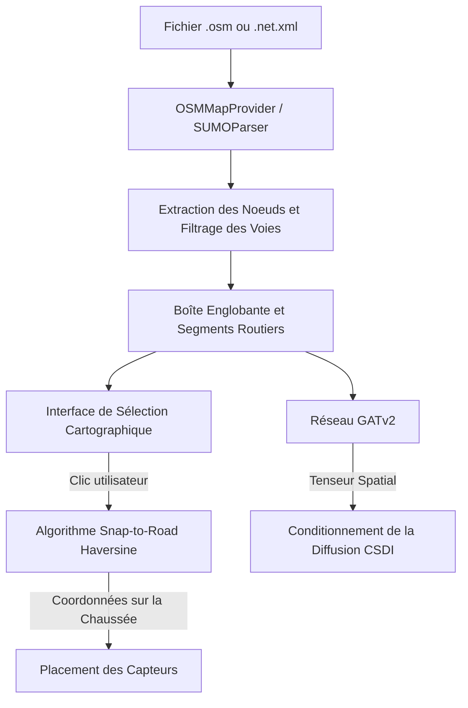

# 🗺️ Topologie Spatiale et Moteur Météorologique de Markov

Ce document spécifie les mécanismes d'ingestion de réseaux routiers OpenStreetMap et SUMO, la projection mathématique Snap-to-Road par la formule de Haversine et le moteur atmosphérique à chaîne de Markov de **SYNTHETIC**.

⬅️ [Hub de Documentation](README.md) | 🏛️ [Architecture Système](architecture.md) | 🧠 [IA Générative et Physique](generative_ai_and_physics.md) | 🖥️ [Interface Desktop](ui_and_localization.md)

---

## 1. Intégration Topologique et Cartographique

SYNTHETIC ancre la simulation de trafic dans les données réelles OpenStreetMap (`.osm`) et réseaux SUMO (`.net.xml`) :

---

## 2. Mécanisme Mathématique "Snap-to-Road"

Les clics humains sur l'écran ne tombent jamais exactement sur la chaussée. L'`OSMMapProvider` projette les coordonnées $(\phi_{clic}, \lambda_{clic})$ sur le segment routier le plus proche $[(\phi_A, \lambda_A), (\phi_B, \lambda_B)]$ en calculant les distances orthodromiques de Haversine :

$$d = 2R \arcsin \left( \sqrt{\sin^2\left(\frac{\Delta \phi}{2}\right) + \cos(\phi_1)\cos(\phi_2)\sin^2\left(\frac{\Delta \lambda}{2}\right)} \right)$$

Le point résultant est verrouillé sur la chaussée réelle, garantissant un réalisme spatial strict.

---

## 3. Évolution Météorologique par Chaîne de Markov

L'atmosphère évolue selon une **chaîne de Markov** définie dans `config/weather_rules.json` :
* Transitions logiques : Ensoleillé $\to$ Partiellement Nuageux $\to$ Pluie $\to$ Orage $\to$ Éclaircie.
* Chaque jour reçoit un triplet sémantique `(Condition, Intensité, Caractéristique)` (ex : *"Pluie forte avec chaussée glissante"*), qui est traduit et injecté dans le prompt du modèle Phi-4-mini.

---

## 4. Synchronisation Temporelle au "Ground Zero"

Afin de normaliser les jeux de données d'entraînement pour l'apprentissage par renforcement, toutes les simulations débutent au **Lundi suivant à 00:00:00**, reproduisant parfaitement le cycle hebdomadaire de trafic urbain.

---

   
  <b>Noxfort Systems</b> — <i>A State Of Art Company</i>

