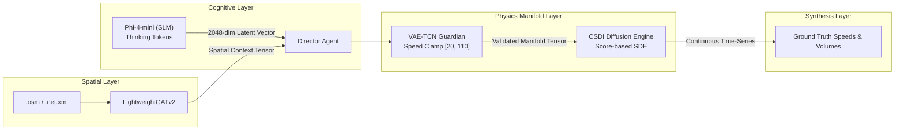

# 🧠 Generative AI, Physics Guardian & Diffusion Process

This document details the neural formulations, mathematical foundations, and deep learning architectures driving **SYNTHETIC**: the Small Language Model (SLM) cognitive screenwriter, the VAE-TCN Physics Guardian, the CSDI Conditional Score-based Diffusion Engine, and the Optuna Just-In-Time AutoML tuner.

⬅️ [Documentation Hub](index.md) | 🏛️ [System Architecture](architecture.md) | 📡 [Multi-Modal Generators](multimodal_generators.md) | 🔄 [CI/CD Pipeline](ci_cd.md) | 🧪 [Testing Suite](testing.md)

---

## 1. Hybrid Generative Pipeline Overview

Traffic scenario synthesis in SYNTHETIC is governed by a multi-tier neural framework:

---

## 2. Cognitive Layer: Screenwriter Agent (`src/agents/screenwriter.py`)

The **Screenwriter Agent** utilizes Microsoft's **Phi-4-mini** model via quantized GGUF execution (`llama-cpp-python`). Rather than relying on simple stochastic text generation, the agent is prompted into deep chain-of-thought reasoning (`<think>...</think>`).

### 2.1 The Latent Projection
1. The model ingests a structured prompt containing:
   - Dynamic weather state (e.g., *"Heavy rain with localized ponding"*).
   - Calendar constraints (e.g., *"Wednesday - Peak Morning Rush"*).
   - User flow intensity (e.g., *"Caótico - 600 vehicles base"*).
2. The model reasons through urban transit repercussions (incident likelihood, travel time inflation, lane capacity degradation).
3. The internal embedding states of the last transformer layer are pooled and projected into a dense **2048-dimensional continuous latent vector**:
   $$\mathbf{z}_{dream} \in \mathbb{R}^{2048}$$

---

## 3. Physics Guardian: VAE-TCN (`src/models/vae_tcn.py`)

Language models have no innate understanding of Newtonian kinematics or traffic fluid dynamics. The **VAE-TCN (Variational Autoencoder with Temporal Convolutional Networks)** acts as a symbolic-neural barrier ensuring physical plausibility.

### 3.1 Architecture & Temporal Convolutions
- **Encoder:** Dilated 1D causal convolutions that compress input trajectories without future leakage.
- **Variational Bottleneck:** Computes mean $\boldsymbol{\mu}$ and log-variance $\log \boldsymbol{\sigma}^2$ to project vectors onto a learned valid traffic manifold.
- **Decoder:** Transposed temporal convolutions reconstructing valid velocity and volume profiles.

### 3.2 Loss Function & Physics Penalties
The VAE-TCN is optimized using an augmented loss function that couples reconstruction error, Kullback-Leibler divergence, and hard physical constraints:

$$\mathcal{L} = \mathcal{L}_{recon} + \beta \mathcal{D}_{KL}(q_\phi(\mathbf{z}|\mathbf{x}) \parallel p(\mathbf{z})) + \lambda_{phys} \mathcal{L}_{physics}$$

Where the physical penalty enforces:
1. **Speed Clamping:** Restricts free-flow velocity to $v \in [20, 110] \text{ km/h}$.
2. **Kinematic Bounds:** Penalizes instantaneous vehicle teleportation and negative headway delays:
   $$\mathcal{L}_{physics} = \sum_{t} \max\left(0, v_{\min} - v_t\right)^2 + \max\left(0, v_t - v_{\max}\right)^2 + \left| \frac{\partial v}{\partial t} \right|_{> a_{\max}}$$

### 3.3 Temporal Inertia
To maintain day-to-day realism across multi-day runs, the Director blends the current day's vector with the previous day:
$$\mathbf{z}_{effective}^{(t)} = 0.70 \cdot \mathbf{z}_{dream}^{(t)} + 0.30 \cdot \mathbf{z}_{effective}^{(t-1)}$$

---

## 4. Conditional Score-Based Diffusion: CSDI Engine (`src/models/csdi_engine.py`)

High-frequency time-series curves (speeds and traffic counts) are generated using **CSDI (Conditional Score-based Diffusion Models for Imputation and Synthesis)**.

### 4.1 Forward and Reverse Diffusion
1. **Forward Process (Noise Injection):** Adds Gaussian perturbation over $T$ timesteps according to a cosine variance schedule $\beta_1, \dots, \beta_T$:
   $$q(\mathbf{x}_t \mid \mathbf{x}_{t-1}) = \mathcal{N}\left(\mathbf{x}_t; \sqrt{1 - \beta_t}\mathbf{x}_{t-1}, \beta_t \mathbf{I}\right)$$
2. **Reverse Process (Conditional Denoising):** A deep bidirectional dilated convolutional backbone predicts the added score conditioned on the validated vector $\mathbf{z}$ and spatial topology context $\mathbf{g}$:
   $$p_\theta(\mathbf{x}_{t-1} \mid \mathbf{x}_t, \mathbf{z}, \mathbf{g}) = \mathcal{N}\left(\mathbf{x}_{t-1}; \boldsymbol{\mu}_\theta(\mathbf{x}_t, t \mid \mathbf{z}, \mathbf{g}), \boldsymbol{\Sigma}_\theta(\mathbf{x}_t, t)\right)$$

### 4.2 Seed Tail for Seamless Multi-Day Boundaries
To prevent disjoint steps between consecutive days, the CSDI engine saves the final 2 hours of day $t-1$ as a `seed_tail`. During the synthesis of day $t$, this tail is injected into the initial conditions of the reverse diffusion sampler.

---

## 5. Just-In-Time AutoML Tuner (`src/optimizer/tuner.py`)

When the VAE-TCN calculates an anomaly score $> 1.00$ (indicating that the Screenwriter dreamed a novel, unseen extreme condition such as a blizzard combined with catastrophic flow), an **Optuna-driven Bayesian optimization study** is dynamically spawned.

* **Exploration Space:**
  - `n_tcn_layers`: 2 to 4
  - `tcn_base_channels`: 16, 32, 64
  - `learning_rate`: $1\times 10^{-4}$ to $1\times 10^{-2}$
  - `beta` (KL weight): 0.5 to 2.5
  - `lambda_physics`: 0.1 to 1.0
  - CSDI `residual_channels`: 64, 96, 128
  - CSDI `diffusion_steps`: 20 to 100
* **Early Stopping Callback:** Terminates trials early when performance stagnates for 2 consecutive evaluations, completing full adaptation in seconds without stalling the user interface.

---

## 6. Hydrodynamic Traffic PDE Engine (`src/physics/`)

To complement neural approximations with exact continuum mechanics, SYNTHETIC incorporates a dedicated numerical physics engine.

### 6.1 Lighthill-Whitham-Richards (LWR) Model
Traffic flow adheres to the conservation of vehicle mass along a 1D spatial continuum:
$$\frac{\partial \rho}{\partial t} + \frac{\partial q}{\partial x} = 0$$
where $\rho(x, t)$ is vehicle density (veh/km) and $q(x, t) = \rho v(\rho)$ is traffic volume flow (veh/h).

### 6.2 Greenshields Fundamental Diagram (`src/physics/greenshields.py`)
The relationship between spatial density and vehicle speed is modeled parabolically via Greenshields' equation:
$$v(\rho) = v_{\max} \left(1 - \frac{\rho}{\rho_{\max}}\right)$$
Yielding the concave flux curve:
$$q(\rho) = \rho \cdot v_{\max} \left(1 - \frac{\rho}{\rho_{\max}}\right)$$
With critical density $\rho_c = \frac{1}{2}\rho_{\max}$ and road capacity $C = q_{\max} = \frac{1}{4} v_{\max} \rho_{\max}$.

### 6.3 Godunov Numerical Riemann Flux Solver (`src/physics/godunov.py`)
To prevent non-physical shocks or numerical dispersion, cell interface fluxes $F_{i+1/2}$ are computed using Godunov's exact Riemann solver formulated through supply and demand:
- **Demand (Sending Capacity):**
  $$D(\rho_i) = \begin{cases} q(\rho_i), & \text{if } \rho_i \le \rho_c \\ C, & \text{if } \rho_i > \rho_c \end{cases}$$
- **Supply (Receiving Capacity):**
  $$S(\rho_{i+1}) = \begin{cases} C, & \text{if } \rho_{i+1} \le \rho_c \\ q(\rho_{i+1}), & \text{if } \rho_{i+1} > \rho_c \end{cases}$$
- **Numerical Interface Flux:**
  $$F_{i+1/2} = \min\left(D(\rho_i), S(\rho_{i+1})\right)$$

Density updates follow explicit Euler conservation:
$$\rho_i^{t+\Delta t} = \rho_i^t + \frac{\Delta t}{\Delta x} \left(F_{i-1/2}^t - F_{i+1/2}^t\right)$$
Subject to the Courant-Friedrichs-Lewy (CFL) stability criterion: $\Delta t \le \frac{\Delta x}{v_{\max}}$.

### 6.4 Rankine-Hugoniot Shockwave Jump Condition (`src/physics/shockwave.py`)
At interfaces where upstream and downstream traffic states experience discontinuous jumps $(\rho_1, q_1) \to (\rho_2, q_2)$ (e.g. at red signals or incident bottlenecks), the shockwave front propagates at velocity:
$$u_s = \frac{q_2 - q_1}{\rho_2 - \rho_1}$$
- $u_s < 0$: Backward-propagating congestion shockwave.
- $u_s > 0$: Forward-moving traffic clearing front.
- $u_s = 0$: Stationary bottleneck shock.

### 6.5 Actuated Signal Controller & Dynamic Incident Manager
- **SignalController (`src/physics/signal_controller.py`):** Modulates downstream supply $S$ at intersection stop-lines to 0 during red phases and opens to full capacity during green phases, supporting demand-responsive actuation.
- **IncidentManager (`src/engine/incident_manager.py`):** Degrades effective road capacity $C_{eff} = C \cdot (1 - \alpha_{incident})$ and tracks spatio-temporal clearance.

---

## 7. Spatio-Temporal Graph Attention: ST-GATv2 (`src/models/st_gatv2.py`)

### 7.1 Time2Vec Continuous Periodic Embedding
To encode continuous diurnal and intra-week cyclical patterns without discretization artifacts, the temporal coordinate $\tau$ (seconds of day) is projected via Time2Vec:
$$\mathbf{t2v}(\tau)[i] = \begin{cases} \omega_0 \tau + \phi_0, & i = 0 \text{ (linear trend)} \\ \sin(\omega_i \tau + \phi_i), & 1 \le i < d \text{ (periodic harmonics)} \end{cases}$$
where $\omega_i, \phi_i$ are learnable frequencies and phase shifts.

### 7.2 Dynamic Graph Attention with Tidal Commuter Bias
The node representation $\mathbf{h}_i = [\mathbf{x}_i \parallel \mathbf{t2v}(\tau)]$ passes through multi-head dynamic attention (GATv2):
$$\alpha_{ij} = \frac{\exp\left(\text{LeakyReLU}\left(\mathbf{a}^\top [\mathbf{W} \mathbf{h}_i \parallel \mathbf{W} \mathbf{h}_j] + \beta_{tidal} \cdot \Delta c_{ij}\right)\right)}{\sum_{k \in \mathcal{N}(i)} \exp\left(\text{LeakyReLU}\left(\mathbf{a}^\top [\mathbf{W} \mathbf{h}_i \parallel \mathbf{W} \mathbf{h}_k] + \beta_{tidal} \cdot \Delta c_{ik}\right)\right)}$$
where $\Delta c_{ij} = c_j - c_i$ injects centripetal tidal commuter bias (pulling traffic toward downtown in morning rush hours and outwards during evening peaks).

---

   
  <b>Noxfort Systems</b> — <i>A State Of Art Company</i>

