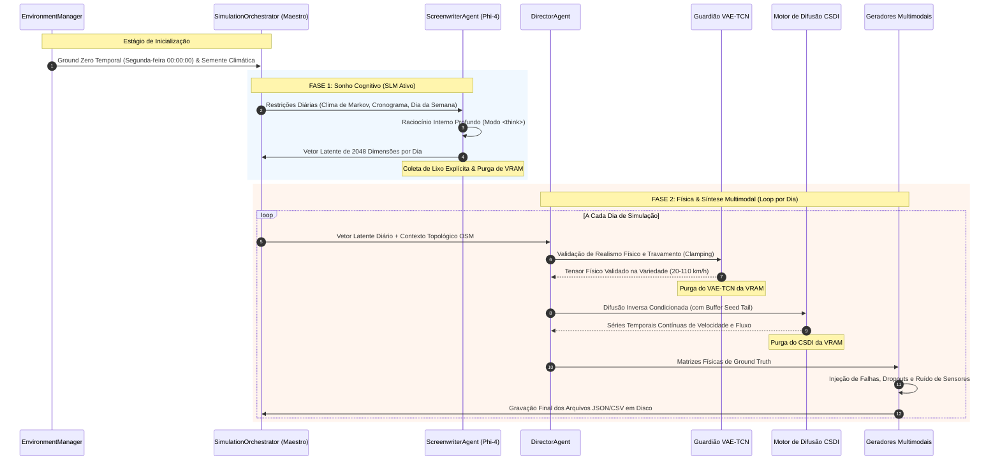

# 🏛️ SYNTHETIC: Blueprint do Sistema e Arquitetura de Execução

Este documento especifica a arquitetura técnica do ecossistema **SYNTHETIC**, motor corporativo de IA generativa híbrida projetado para síntese de cenários de tráfego multimodal de alta fidelidade. O texto detalha o pipeline de execução em duas fases, o gerenciamento dinâmico de memória por carregamento tardio sequencial (Sequential Lazy Loading) e a estrita separação entre leis físicas e percepção sensorial.

⬅️ [Central de Documentação](README.md) | 🧠 [IA Generativa e Física](generative_ai_and_physics.md) | 📡 [Geradores Multimodais](multimodal_generators.md) | 🧪 [Testes e QA](testing.md)

---

## 1. Filosofia de Arquitetura e Fundamentos

O SYNTHETIC supera simulações estáticas determinísticas ao modelar as complexas dinâmicas não-lineares das malhas viárias urbanas reais:

1. **Separação Rígida entre Física Fundamental e Percepção:** No mundo real, a física não falha — veículos não se teletransportam e a inércia não é violada. Entretanto, sensores (GPS, laços indutivos, câmeras) falham continuamente por ruído, perdas de pacote e anomalias de hardware. O SYNTHETIC sintetiza primeiramente a física real perfeita e, em seguida, aplica uma camada deliberada de corrupção de percepção.
2. **Liberação Sequencial de Recursos (Desperdício Zero de VRAM):** Modelos generativos profundos (Phi-4 SLM, VAE-TCN, Difusão CSDI, Redes de Atenção em Grafos) exigem alto volume de VRAM. A arquitetura impõe carregamento sequencial sob demanda: cada rede só entra na GPU no momento exato de sua inferência e é purgada imediatamente via `gc.collect()` e `torch.cuda.empty_cache()`.
3. **Princípio da Responsabilidade Única (SRP):** Raciocínio cognitivo é isolado no Roteirista (Screenwriter), verificação de fronteiras físicas no Diretor, topologia viária na GATv2 e transições meteorológicas no motor de Markov.

---

## 2. O Ciclo de Vida de Geração em Duas Fases

O ciclo de vida da simulação é dividido em dois estágios assíncronos para garantir operação estável mesmo em GPUs com apenas 4 GB a 6 GB de VRAM:



### 2.1 Fase 1: A Fase do "Sonho" (Camada Cognitiva)
* **Modelo:** Phi-4-mini Reasoning Model (Quantização GGUF via `llama-cpp-python`).
* **Entrada:** Parâmetros de simulação, restrições de calendário e estado meteorológico dinâmico gerado pelo `EnvironmentManager`.
* **Execução:** O modelo ativa seu modo de pensamento interno (`<think>...</think>`), raciocinando sobre impactos no tráfego (ex: chuva forte causando retenções e redução de velocidade livre). Os estados ocultos da última camada do transformer são projetados em um **vetor latente contínuo de 2048 dimensões**.
* **Limpeza:** Concluído o planejamento de todos os dias da simulação, o Phi-4 é purgado da memória antes do início da Fase 2.

### 2.2 Fase 2: Física & Síntese Multimodal
Coordenada pelo `DirectorAgent`, itera sequencialmente pelos dias planejados:
1. **LightweightGATv2:** Extrai embeddings topológicos de cruzamentos (nós) e avenidas (arestas) a partir da malha OpenStreetMap (`.osm`).
2. **VAE-TCN (Guardião de Física):** Projeta o vetor do SLM na variedade de física viária válida, travando velocidades em $[20, 110]\text{ km/h}$. Dispara AutoML (Optuna) se detectar anomalias severas.
3. **Motor CSDI:** Resolve a equação diferencial estocástica de difusão reversa para gerar séries temporais de fluxo e velocidade, usando um buffer `seed_tail` do dia anterior para evitar saltos temporais descontínuos.

---

## 3. Arquitetura Dinâmica de Memória VRAM

| Passo | Componente Neural | VRAM Alocada | Ação Imediata pós-Execução |
|:---:|:---|:---:|:---|
| **P1** | Phi-4-mini (GGUF Q6_K) | ~2.800 MB | Destruição total via `gc.collect()` e `empty_cache()` |
| **P2.1** | LightweightGATv2 | ~150 MB | Tensor topológico extraído; modelo descarregado |
| **P2.2** | Guardião VAE-TCN | ~320 MB | Anomalia checada, velocidades travadas; purgado |
| **P2.3** | Backbone Difusão CSDI | ~850 MB | Amostragem reversa concluída; descarregado |
| **P2.4** | Geradores de Sensores | ~45 MB RAM | Streaming contínuo de JSON e CSV em disco |

---

## 4. Hierarquia de Subsistemas e Mapa de Diretórios

```text
SYNTHETIC/
├── src/
│   ├── agents/          # Agentes de Orquestração (Diretor, Roteirista)
│   ├── algorithms/      # Processos estocásticos de difusão e agendadores SDE
│   ├── core/            # Ambiente temporal, lógica de simulação e topologia viária
│   ├── engine/          # Gerenciamento de incidentes e degradação de faixas
│   ├── flow/            # Estratégias de fluxo e invariantes matemáticos
│   ├── globalf/         # Geradores globais de navegação (Waze, TomTom)
│   ├── localf/          # Geradores de sensores locais (Câmeras LPR, Laços Indutivos)
│   ├── memory/          # TopologyMemory, SpatioTemporalMemory, SensorMemory
│   ├── models/          # Modelos neurais profundos (Phi-4, VAE-TCN, CSDI, GATv2, ST-GATv2, PINN)
│   ├── optimizer/       # Ajustador AutoML JIT (Optuna) e callbacks de poda
│   ├── parsers/         # Parsers OpenStreetMap (.osm) e SUMO (.net.xml)
│   ├── physics/         # Motor de EDP hidrodinâmica (Godunov LWR, Greenshields, Ondas de Choque, Semáforos)
│   └── services/        # ModelManager, SpatialService, PhysicsInterpreter
├── ui/                  # Interface gráfica CustomTkinter, TkinterMapView e internacionalização
├── tests/               # 99 casos de testes automatizados em 18 suítes (86% de cobertura)
└── docs/                # Portal bilíngue de documentação técnica
```

---

<div align="center">
  <br/>
  <b>Noxfort Systems</b> — <i>A State Of Art Company</i>
</div>
