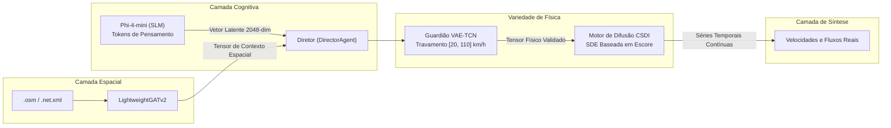

# 🧠 IA Generativa, Guardião de Física e Processo de Difusão

Este documento detalha as formulações neurais, os fundamentos matemáticos e as arquiteturas de aprendizado profundo do **SYNTHETIC**: o modelo de linguagem local Phi-4-mini, o Guardião de Física VAE-TCN, o motor de difusão condicional baseada em escores (CSDI) e o otimizador AutoML com Optuna.

⬅️ [Central de Documentação](README.md) | 🏛️ [Arquitetura do Sistema](architecture.md) | 📡 [Geradores Multimodais](multimodal_generators.md) | 🗺️ [Topologia Espacial](spatial_and_environment.md)

---

## 1. Visão Geral da Pipeline Neural Híbrida

A síntese no SYNTHETIC não depende de processos estocásticos puros nem de regras engessadas, mas de uma orquestração em camadas:

---

## 2. Camada Cognitiva: Agente Roteirista (`src/agents/screenwriter.py`)

O **ScreenwriterAgent** opera o modelo **Phi-4-mini** da Microsoft em formato GGUF quantizado via `llama-cpp-python`. O modelo é estimulado a produzir raciocínio explícito em cadeia de pensamento (`<think>...</think>`).

### 2.1 A Projeção Latente
1. Recebe o prompt contextual com clima dinâmico, dia do calendário e nível de fluxo viário.
2. Raciocina sobre os impactos na capacidade da malha e na propensão a sinistros.
3. Os estados ocultos da camada final do transformador são agregados e projetados em um **vetor latente contínuo de 2048 dimensões**:
   $$\mathbf{z}_{dream} \in \mathbb{R}^{2048}$$

---

## 3. Guardião de Física: VAE-TCN (`src/models/vae_tcn.py`)

Redes de linguagem pura sofrem de alucinação e desconhecem leis cinemáticas. O **VAE-TCN (Autoencoder Variacional com Convoluções Temporais)** funciona como uma barreira neuro-simbólica.

### 3.1 Função de Perda com Penalidade Física
O treinamento do VAE-TCN incorpora perdas de reconstrução, divergência de Kullback-Leibler e termos de barreira física:

$$\mathcal{L} = \mathcal{L}_{recon} + \beta \mathcal{D}_{KL}(q_\phi(\mathbf{z}|\mathbf{x}) \parallel p(\mathbf{z})) + \lambda_{phys} \mathcal{L}_{physics}$$

Onde $\mathcal{L}_{physics}$ penaliza violações de velocidade livre e acelerações irreais:
$$\mathcal{L}_{physics} = \sum_{t} \max\left(0, v_{\min} - v_t\right)^2 + \max\left(0, v_t - v_{\max}\right)^2 + \left| \frac{\partial v}{\partial t} \right|_{> a_{\max}}$$

### 3.2 Inércia Temporal
Para garantir coerência física entre dias consecutivos, o Diretor combina o vetor latente do dia atual com o dia anterior:
$$\mathbf{z}_{efetivo}^{(t)} = 0{,}70 \cdot \mathbf{z}_{dream}^{(t)} + 0{,}30 \cdot \mathbf{z}_{efetivo}^{(t-1)}$$

---

## 4. Difusão Condicional por Escores: CSDI (`src/models/csdi_engine.py`)

As curvas de alta resolução temporal de fluxo e velocidade são geradas por **Modelos de Difusão Condicional Baseados em Escore (CSDI)**.

### 4.1 Processo Reverso de Denoising
A rede convolucional temporal bidirecional do CSDI remove ruído gaussiano iterativamente condicionado no vetor latente validado $\mathbf{z}$ e nas atenções de grafo $\mathbf{g}$:
$$p_\theta(\mathbf{x}_{t-1} \mid \mathbf{x}_t, \mathbf{z}, \mathbf{g}) = \mathcal{N}\left(\mathbf{x}_{t-1}; \boldsymbol{\mu}_\theta(\mathbf{x}_t, t \mid \mathbf{z}, \mathbf{g}), \boldsymbol{\Sigma}_\theta(\mathbf{x}_t, t)\right)$$

### 4.2 Seed Tail (Continuidade de Fronteira)
O motor armazena as últimas duas horas do dia $t-1$ como um `seed_tail`. Na geração do dia $t$, esse vetor atua como condição inicial no amostrador estocástico, eliminando descontinuidades artificiais à meia-noite.

---

## 5. Ajuste AutoML Just-In-Time com Optuna (`src/optimizer/tuner.py`)

Caso o VAE-TCN detecte uma anomalia severa ($> 1{,}00$) — indicando que o Roteirista concebeu um cenário extremo inédito —, o sistema dispara um estudo bayesiano com **Optuna** em background:
* **Espaço de Busca:** canais base da TCN (16 a 64), taxa de aprendizado ($10^{-4}$ a $10^{-2}$), canais residuais do CSDI (64 a 128) e passos de difusão (20 a 100).
* **Early Stopping:** Conclui a otimização em segundos sem travar a interface gráfica do usuário.

---

## 6. Motor de EDP Hidrodinâmica de Tráfego (`src/physics/`)

Para complementar as aproximações neurais com mecânica dos fluidos contínua exata, o SYNTHETIC incorpora um motor numérico determinístico baseado em conservação física.

### 6.1 Modelo Lighthill-Whitham-Richards (LWR)
O escoamento macroscópico de tráfego obedece à equação de conservação contínua de massa vehicular em 1D:
$$\frac{\partial \rho}{\partial t} + \frac{\partial q}{\partial x} = 0$$
onde $\rho(x, t)$ representa a densidade viária (veíc/km) e $q(x, t) = \rho \cdot v(\rho)$ o fluxo de tráfego (veíc/h).

### 6.2 Diagrama Fundamental de Greenshields (`src/physics/greenshields.py`)
A relação entre densidade espacial e velocidade média pontual é dada pelo perfil parabólico de Greenshields:
$$v(\rho) = v_{\max} \left(1 - \frac{\rho}{\rho_{\max}}\right)$$
resultando na curva parabólica de fluxo:
$$q(\rho) = \rho \cdot v_{\max} \left(1 - \frac{\rho}{\rho_{\max}}\right)$$
com densidade crítica de capacidade máxima $\rho_c = \frac{1}{2}\rho_{\max}$ e capacidade limite $C = q_{\max} = \frac{1}{4} v_{\max} \rho_{\max}$.

### 6.3 Resolvedor Numérico de Fluxo de Riemann de Godunov (`src/physics/godunov.py`)
Para evitar descontinuidades não físicas ou difusão numérica artificial, os fluxos nas fronteiras entre células $F_{i+1/2}$ são calculados pelo método de Godunov desacoplado em demanda e oferta viária:
- **Demanda de Envio a Montante:**
  $$D(\rho_i) = \begin{cases} q(\rho_i), & \text{se } \rho_i \le \rho_c \\ C, & \text{se } \rho_i > \rho_c \end{cases}$$
- **Oferta de Recepção a Jusante:**
  $$S(\rho_{i+1}) = \begin{cases} C, & \text{se } \rho_{i+1} \le \rho_c \\ q(\rho_{i+1}), & \text{se } \rho_{i+1} > \rho_c \end{cases}$$
- **Fluxo Numérico de Interface:**
  $$F_{i+1/2} = \min\left(D(\rho_i), S(\rho_{i+1})\right)$$

A atualização das densidades é realizada via método explícito em volumes finitos:
$$\rho_i^{t+\Delta t} = \rho_i^t + \frac{\Delta t}{\Delta x} \left(F_{i-1/2}^t - F_{i+1/2}^t\right)$$
respeitando a condição de estabilidade de Courant-Friedrichs-Lewy (CFL): $\Delta t \le \frac{\Delta x}{v_{\max}}$.

### 6.4 Condição de Salto de Onda de Choque de Rankine-Hugoniot (`src/physics/shockwave.py`)
Quando há descontinuidade entre o estado a montante e a jusante $(\rho_1, q_1) \to (\rho_2, q_2)$ (ex.: em semáforos vermelhos ou retenções por acidentes), a frente da onda de choque se propaga a uma velocidade finita:
$$u_s = \frac{q_2 - q_1}{\rho_2 - \rho_1}$$
- $u_s < 0$: Choque de congestionamento propagando-se contra o tráfego (para trás).
- $u_s > 0$: Frente de dissipação de tráfego movendo-se no sentido da via (para a frente).
- $u_s = 0$: Gargalo estacionário permanente.

### 6.5 Controlador Semafórico Atuado e Gestão de Incidentes
- **SignalController (`src/physics/signal_controller.py`):** Modula a oferta $S$ para zero na faixa de retenção durante o vermelho e libera a capacidade máxima durante o verde, suportando acionamento dinâmico por demanda.
- **IncidentManager (`src/engine/incident_manager.py`):** Aplica fatores de degradação da capacidade viária $C_{eff} = C \cdot (1 - \alpha_{acidente})$ com dinâmica de remoção temporal.

---

## 7. Atenção em Grafos Espaço-Temporais: ST-GATv2 (`src/models/st_gatv2.py`)

### 7.1 Embeddings Contínuos com Time2Vec
Para modelar padrões circadianos e semanais contínuos sem artefatos de discretização em baldes fixos, as coordenadas de tempo $\tau$ são transformadas via Time2Vec:
$$\mathbf{t2v}(\tau)[i] = \begin{cases} \omega_0 \tau + \phi_0, & i = 0 \text{ (tendência linear)} \\ \sin(\omega_i \tau + \phi_i), & 1 \le i < d \text{ (harmônicos periódicos)} \end{cases}$$

### 7.2 Atenção Dinâmica com Viés de Maré Pendular
As representações de nós $\mathbf{h}_i = [\mathbf{x}_i \parallel \mathbf{t2v}(\tau)]$ alimentam convoluções dinâmicas de atenção:
$$\alpha_{ij} = \frac{\exp\left(\text{LeakyReLU}\left(\mathbf{a}^\top [\mathbf{W} \mathbf{h}_i \parallel \mathbf{W} \mathbf{h}_j] + \beta_{mar\acute{e}} \cdot \Delta c_{ij}\right)\right)}{\sum_{k \in \mathcal{N}(i)} \exp\left(\text{LeakyReLU}\left(\mathbf{a}^\top [\mathbf{W} \mathbf{h}_i \parallel \mathbf{W} \mathbf{h}_k] + \beta_{mar\acute{e}} \cdot \Delta c_{ik}\right)\right)}$$
onde $\Delta c_{ij} = c_j - c_i$ injeta o gradiente centrípeto/centrífugo de atração em horários de pico comercial matutino e vespertino.

---

   
  <b>Noxfort Systems</b> — <i>A State Of Art Company</i>

