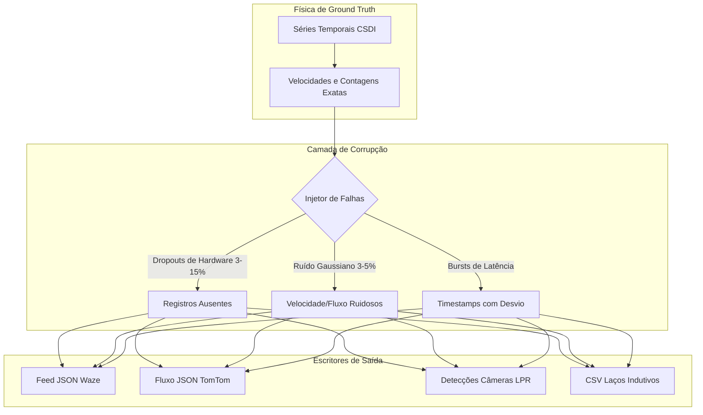

# 📡 Geradores Multimodais e Camada de Corrupção de Sensores

Este documento fornece as especificações técnicas de todos os geradores de dados do **SYNTHETIC**, incluindo esquemas de saída, modelagem física, injeção de falhas e arquitetura de armazenamento em disco.

⬅️ [Central de Documentação](README.md) | 🏛️ [Arquitetura do Sistema](architecture.md) | 🧠 [IA Generativa e Física](generative_ai_and_physics.md) | 🗺️ [Topologia Espacial](spatial_and_environment.md)

---

## 1. Princípio da Responsabilidade Única: Física vs. Percepção

No SYNTHETIC, **a física é contínua e determinística, enquanto a percepção sensorial é ruidosa e propensa a falhas**:

---

## 2. Especificação dos Geradores

### 2.1 Gerador de Feeds Waze (`src/globalf/waze_generator.py`)
Simula dados de navegação comunitária via GPS, reportando lentidões, congestionamentos, acidentes e vias bloqueadas.
* **Formato:** JSON (`waze_feed_YYYYMMDD_HHMMSS.json`)
* **Principais Campos:** `alerts` (tipo, subtipo, coordenadas lat/lon, confiabilidade, reputação do usuário) e `jams` (velocidade média, atraso em segundos, comprimento da fila em metros, nível de congestionamento de 1 a 5).

### 2.2 Gerador de Segmentos TomTom (`src/globalf/tomtom_generator.py`)
Simula telemetria de frotas comerciais e dados corporativos de tráfego arterial.
* **Formato:** JSON (`tomtom_flow_YYYYMMDD_HHMMSS.json`)
* **Principais Campos:** `flowSegmentData` com classificação funcional de vias (FRC1 a FRC6), velocidade atual, velocidade de fluxo livre, tempo de viagem atual e razão de atraso.

### 2.3 Gerador de Câmeras Ópticas / ANPR (`src/localf/camera_generator.py`)
Simula radares visuais e câmeras de monitoramento urbano com OCR/LPR de leitura de placas veiculares.
* **Formato:** JSON (`cam_XX_YYYYMMDD_HHMMSS.json`)
* **Principais Campos:** `sensor_id`, `timestamp`, `detections` (placa sintética no padrão Mercosul, nível de confiança do OCR, faixa de rolamento, classificação veicular e velocidade instantânea).

### 2.4 Gerador de Laços Indutivos Eletromagnéticos (`src/localf/loop_generator.py`)
Simula sensores eletromagnéticos instalados sob o pavimento asfáltico.
* **Formato:** CSV (`loop_XX_YYYYMMDD_HHMMSS.csv`)
* **Colunas:** `timestamp`, `detector_id`, `lane`, `vehicle_count`, `occupancy_percent`, `avg_speed_kmh`, `status`.

---

## 3. Motor de Injeção de Falhas e Ruído

Quando ativado na interface gráfica, a camada de corrupção aplica distorções realistas:
1. **Dropouts de Hardware (3% a 15%):** Descarte estocástico de amostras simulando falhas em enlaces de comunicação 4G/fibra.
2. **Bursts de Anomalias:** Intervalos sequenciais com perda total de dados de telemetria por vários minutos.
3. **Ruído Gaussiano (3% a 5%):** Perturbação suave nas métricas de velocidade e volume:
   $$v_{observado} = v_{real} \cdot \left(1 + \mathcal{N}\left(0, \sigma^2\right)\right), \quad \sigma \in [0{,}03; 0{,}05]$$

---

   
  <b>Noxfort Systems</b> — <i>A State Of Art Company</i>

