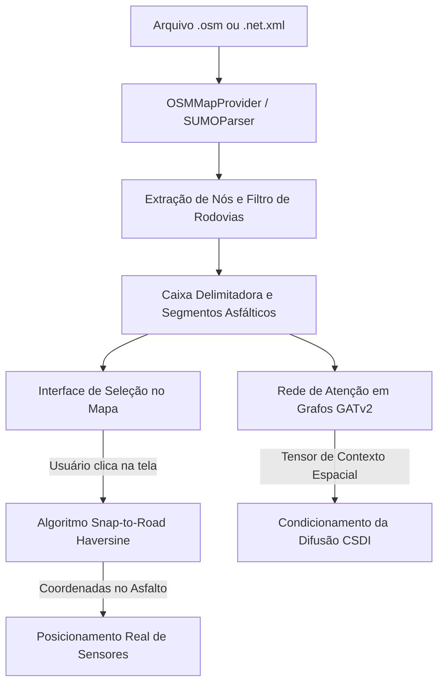

# 🗺️ Topologia Espacial e Motor Meteorológico de Markov

Este documento especifica os mecanismos de ingestão de malhas viárias OpenStreetMap e SUMO, a projeção matemática Snap-to-Road via fórmula de Haversine e a máquina de estados meteorológica de Markov do **SYNTHETIC**.

⬅️ [Central de Documentação](README.md) | 🏛️ [Arquitetura do Sistema](architecture.md) | 🧠 [IA Generativa e Física](generative_ai_and_physics.md) | 🖥️ [Interface Desktop](ui_and_localization.md)

---

## 1. Consciência Espacial e Topologia Viária

Ao contrário de geradores que utilizam linhas de rota estáticas em JSON, o SYNTHETIC ancora a simulação na topografia real de cidades:

---

## 2. Ingestão de Mapas (`src/parsers/`)

### 2.1 OpenStreetMap (`.osm`, `.osm.gz`)
* **Extração de Nós:** Mapeia todos os elementos `<node>` com latitude e longitude para indexação espacial em memória.
* **Filtro de Vias:** Isola elementos `<way>` com a tag `highway` correspondente a tráfego de veículos (`motorway`, `trunk`, `primary`, `secondary`, `tertiary`, `residential`), descartando calçadas e ciclovias.
* **Bounding Box Automático:** Calcula a janela geográfica ótima $(\text{lat}_{\min}, \text{lon}_{\min}, \text{lat}_{\max}, \text{lon}_{\max})$ para posicionar o mapa na interface CustomTkinter.

### 2.2 Redes SUMO (`.net.xml`, `.net.xml.gz`)
Extrai junções semaforizadas e arestas direcionais, convertendo a geometria cartesiana métrica do SUMO em coordenadas geodésicas WGS84 globais via projeções `pyproj`.

---

## 3. O Mecanismo Matemático "Snap-to-Road"

Cliques humanos na tela do computador não possuem precisão milimétrica. O `OSMMapProvider` projeta o ponto $(\phi_{clique}, \lambda_{clique})$ sobre a aresta rodoviária mais próxima $[(\phi_A, \lambda_A), (\phi_B, \lambda_B)]$ calculando distâncias ortodrômicas de Haversine:

$$d = 2R \arcsin \left( \sqrt{\sin^2\left(\frac{\Delta \phi}{2}\right) + \cos(\phi_1)\cos(\phi_2)\sin^2\left(\frac{\Delta \lambda}{2}\right)} \right)$$

O ponto resultante é travado no pavimento asfáltico real, garantindo que nenhum sensor seja gerado dentro de edifícios ou rios.

---

## 4. Motor Meteorológico e Cadeias de Markov (`src/core/environment.py`)

A evolução atmosférica segue uma **máquina de estados de Markov** parametrizada em `config/weather_rules.json`:
* Transições realistas: Céu Limpo $\to$ Parcialmente Nublado $\to$ Chuva $\to$ Tempestade $\to$ Chuva Moderada $\to$ Abertura de Sol.
* **Tupla Semântica Tríplice:** Cada dia de simulação recebe uma tupla descritiva `(Condição, Intensidade, Característica)` (ex: *"Chuva forte com pista escorregadia e retenções"*), que é traduzida e injetada no prompt do modelo de linguagem Phi-4-mini.

---

## 5. Ground Zero Temporal (Sincronização Cíclica)

Para garantir que conjuntos de dados de treinamento de IA capturem a dinâmica semanal de tráfego (pico de segunda-feira a quinta-feira, calmaria de final de semana), as simulações são sincronizadas na **Segunda-feira subsequente às 00:00:00**, evitando descontinuidades de séries temporais.

---

   
  <b>Noxfort Systems</b> — <i>A State Of Art Company</i>

