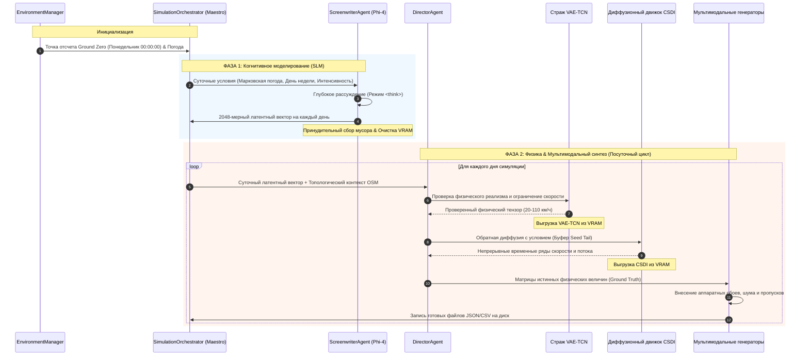

# 🏛️ SYNTHETIC: Архитектура системы и схема выполнения

Настоящий документ описывает техническую архитектуру платформы **SYNTHETIC** — системы гибридного генеративного искусственного интеллекта для высокоточного моделирования мультимодального городского дорожного движения. Документ детализирует двухфазный цикл выполнения, динамическое управление видеопамятью с последовательной ленивой загрузкой нейросетей и строгое разграничение между законами физики и датчиковым восприятием.

⬅️ [Главный Хаб](README.md) | 🧠 [Генеративный ИИ и физика](generative_ai_and_physics.md) | 📡 [Мультимодальные генераторы](multimodal_generators.md) | 🧪 [Тестирование и QA](testing.md)

---

## 1. Философия архитектуры

1. **Разделение физической реальности и восприятия датчиков:** Законы физики незыблемы: транспортные средства подчиняются уравнениям кинематики и инерции. Напротив, датчики (GPS-трекеры, индуктивные петли, камеры распознавания номеров) непрерывно подвержены шумам, потере пакетов и сбоям оборудования. SYNTHETIC сначала рассчитывает математически точную физическую основу, а затем накладывает реалистичный слой аппаратных искажений.
2. **Последовательное освобождение ресурсов (нулевые утечки VRAM):** Тяжелые нейросети (SLM Phi-4, VAE-TCN, диффузионная модель CSDI, GATv2) никогда не загружаются в видеопамять одновременно. Каждая сеть находится в GPU только во время своей стадии инференса и сразу же уничтожается через `gc.collect()` и сброс кэша CUDA.
3. **Принцип единственной ответственности (SRP):** Сценарное моделирование возложено на агента-сценариста (Screenwriter), валидация физических границ — на директора (Director), топология сети — на графовую сеть GATv2, а погодная динамика — на марковскую модель.

---

## 2. Двухфазный жизненный цикл генерации

---

   
  <b>Noxfort Systems</b> — <i>A State Of Art Company</i>

