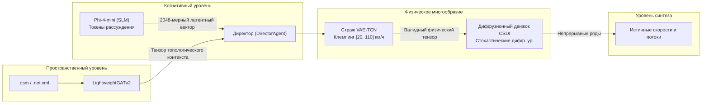

# 🧠 Генеративный ИИ, физический страж и диффузионные процессы

В данном документе представлены математические основы, нейросетевые формулировки и архитектура глубокого обучения платформы **SYNTHETIC**: локальная языковая модель Phi-4-mini, физический страж VAE-TCN, обусловленная диффузионная модель CSDI и оптимизатор гиперпараметров Optuna.

⬅️ [Главный Хаб](README.md) | 🏛️ [Архитектура системы](architecture.md) | 📡 [Мультимодальные генераторы](multimodal_generators.md) | 🗺️ [Пространство и среда](spatial_and_environment.md)

---

## 1. Схема гибридного нейросетевого конвейера

---

## 2. Когнитивный уровень: Агент-сценарист (`src/agents/screenwriter.py`)

Агент использует квантованную модель **Phi-4-mini** в формате GGUF. Модель генерирует логическую цепочку рассуждений в скрытом режиме (`<think>...</think>`), после чего скрытые состояния последнего слоя проецируются в непрерывный латентный вектор размерности 2048:
$$\mathbf{z}_{dream} \in \mathbb{R}^{2048}$$

---

## 3. Физический страж: VAE-TCN (`src/models/vae_tcn.py`)

Вариационный автоэнкодер с временными свертками (VAE-TCN) проецирует вектор сценариста на допустимое многообразие кинематики транспортных потоков.
* **Функция потерь с физическим штрафом:** штрафует отрицательные скорости и телепортацию, жестко ограничивая диапазон скоростей $v \in [20, 110]\text{ км/ч}$.
* **Временная инерция:** для устранения скачков между сутками вектор смешивается с предыдущим днем:
  $$\mathbf{z}_{эффективный}^{(t)} = 0{,}70 \cdot \mathbf{z}_{dream}^{(t)} + 0{,}30 \cdot \mathbf{z}_{эффективный}^{(t-1)}$$

---

## 4. Обусловленная диффузия: движок CSDI (`src/models/csdi_engine.py`)

Генерирует высокочастотные кривые потока и скорости посредством обратного диффузионного процесса, обусловленного вектором $\mathbf{z}$ и графовым контекстом $\mathbf{g}$. Буфер `seed_tail` предотвращает разрывы на стыке суток.

---

## 5. Автоподбор гиперпараметров (AutoML) с Optuna (`src/optimizer/tuner.py`)

При обнаружении аномалий ($> 1{,}00$) система динамически запускает байесовскую оптимизацию **Optuna**, адаптируя параметры сверточных слоев и шагов диффузии без блокировки графического интерфейса.

---

   
  <b>Noxfort Systems</b> — <i>A State Of Art Company</i>

