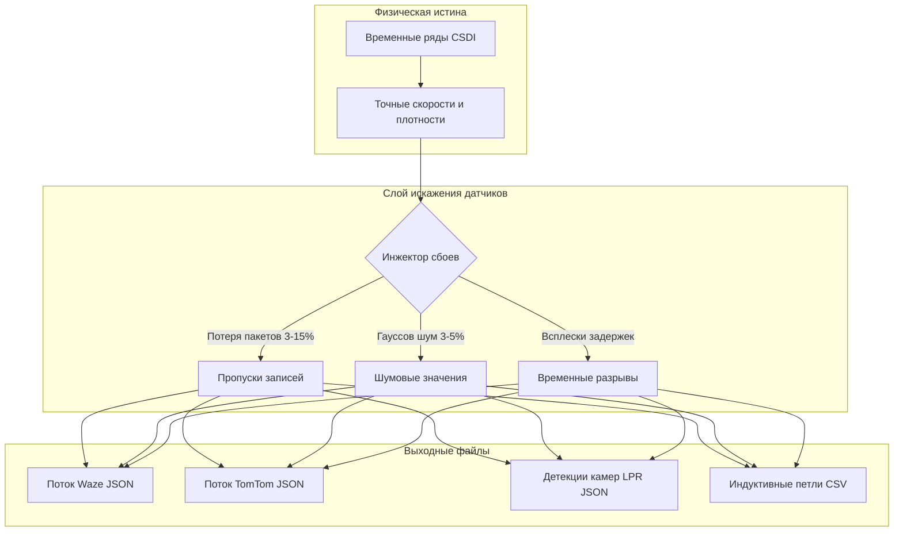

# 📡 Мультимодальные генераторы и слой искажения данных датчиков

В настоящем документе представлены спецификации выходных форматов данных **SYNTHETIC**, математические модели генераторов и механизмы наложения сенсорных погрешностей.

⬅️ [Главный Хаб](README.md) | 🏛️ [Архитектура системы](architecture.md) | 🧠 [Генеративный ИИ и физика](generative_ai_and_physics.md) | 🗺️ [Пространство и среда](spatial_and_environment.md)

---

## 1. Разделение физики и восприятия датчиков

---

## 2. Спецификации форматов

* **Waze (`src/globalf/waze_generator.py`):** Моделирование краудсорсинговых оповещений водителей (заторы, аварии) в формате JSON (`waze_feed_*.json`).
* **TomTom (`src/globalf/tomtom_generator.py`):** Моделирование коммерческой телеметрии по функциональным классам дорог (FRC1–FRC6) в JSON (`tomtom_flow_*.json`).
* **Камеры ANPR/LPR (`src/localf/camera_generator.py`):** Моделирование комплексов фотовидеофиксации с оптическим распознаванием номерных знаков в JSON (`cam_*_*.json`).
* **Индуктивные петли (`src/localf/loop_generator.py`):** Моделирование поддорожных электромагнитных датчиков (интенсивность потока и занятость полосы) в формате CSV (`loop_*_*.csv`).

---

## 3. Моделирование аппаратных сбоев и шума

1. **Аппаратные сбои (3%–15%):** Случайное удаление пакетов телеметрии.
2. **Пакетные пропуски:** Полное отсутствие данных на протяжении нескольких минут.
3. **Мультипликативный гауссов шум (3%–5%):**
   $$v_{измеренная} = v_{истинная} \cdot \left(1 + \mathcal{N}\left(0, \sigma^2\right)\right), \quad \sigma \in [0{,}03; 0{,}05]$$

---

   
  <b>Noxfort Systems</b> — <i>A State Of Art Company</i>

