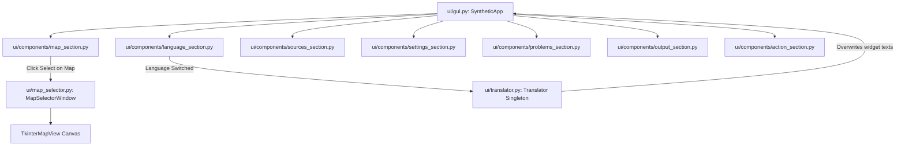

# 🖥️ Desktop UI & Dynamic Localization Architecture

This document describes the user interface architecture of **SYNTHETIC**, focusing on the CustomTkinter layout, the interactive TkinterMapView canvas, thread-safe asynchronous execution, and the dynamic internationalization (i18n) engine.

⬅️ [Documentation Hub](index.md) | 🏛️ [System Architecture](architecture.md) | 🗺️ [Spatial Topology](spatial_and_environment.md) | 🔄 [CI/CD Pipeline](ci_cd.md) | 🧪 [Testing Suite](testing.md)

---

## 1. UI Architecture & Component Hierarchy

The SYNTHETIC desktop frontend is constructed with **CustomTkinter** for high-DPI scaling, native dark/light theme switching, and modular component isolation:



---

## 2. Interactive Map Placement (`ui/map_selector.py`)

The **MapSelectorWindow** embeds **TkinterMapView** to offer an interactive geographical canvas:
1. **Bounding Box Auto-Center:** As soon as a user selects a valid `.osm` or `.net.xml` file, the map automatically centers and calculates the optimal zoom level.
2. **Interactive Sensor Pinning:** Users place visual markers on the map for Cameras and Inductive Loops with immediate visual feedback:
   - Red pins: Video Surveillance / ANPR Cameras.
   - Blue pins: Inductive Loop Detectors.
3. **Snap-to-Road Visual Feedback:** Sensor pins automatically align with the calculated road pavement coordinates using the underlying Haversine projection.
4. **Sensor Quota Tracking:** Real-time headers inform the user of remaining camera and loop quotas before generation can proceed.

---

## 3. Asynchronous Threading & Telemetry Bridge

To prevent GUI freezing during long neural synthesis runs:
* **Background Worker Thread:** When the user clicks **Generate**, the `SimulationOrchestrator` runs inside a dedicated `threading.Thread`.
* **Telemetry Callbacks:** The background thread emits progress events (Phase 1 dreaming progress, Phase 2 daily diffusion completion) which are scheduled on the main GUI thread via `root.after(0, ...)`.
* **Error Handling:** Unhandled exceptions in neural workers or missing file paths are routed through `ui/dialog_service.py` with localized modal dialogs.

---

## 4. Dynamic Internationalization (i18n) Engine

The localization subsystem supports **runtime dynamic hot-swapping** of languages without requiring an application restart.

### 4.1 The Translator Singleton (`ui/translator.py`)
Implemented as a thread-safe Singleton, the `Translator` loads and caches JSON string dictionaries:

```python
from ui.translator import translator

# Direct string query
title = translator.t("app_title")

# Formatted dynamic string query
msg = translator.t("cameras_remaining", count=3)
```

### 4.2 Supported Locales (`ui/locale/`)

| Locale Code | Language | Dictionary File | Coverage |
|:---:|---|:---:|:---:|
| `en` | English | `ui/locale/en.json` | 100% (Default) |
| `pt-br` | Português (Brasil) | `ui/locale/pt-br.json` | 100% |
| `fr` | Français | `ui/locale/fr.json` | 100% |
| `es` | Español | `ui/locale/es.json` | 100% |
| `ru` | Русский | `ui/locale/ru.json` | 100% |
| `zh-cn` | 简体中文 | `ui/locale/zh-cn.json` | 100% |

### 4.3 Runtime Hot-Swapping Mechanism
When a new language is chosen in the GUI combobox:
1. An event listener triggers `translator.load_language(selected_code)`.
2. The UI invokes `SyntheticApp.update_ui_texts()`.
3. Every label, button text, group frame, and tooltip is updated dynamically in-memory.
4. Active sub-windows (such as `MapSelectorWindow`) re-render their instructions and legends instantaneously.

---

<div align="center">
  <br/>
  <b>Noxfort Systems</b> — <i>A State Of Art Company</i>
</div>
