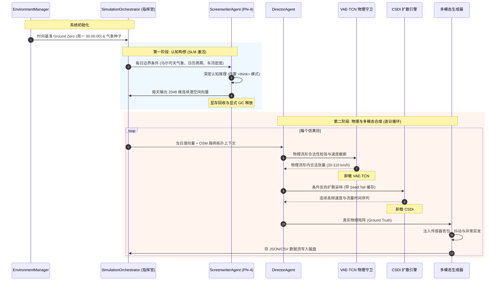

# 🏛️ SYNTHETIC: 系统架构规范与执行蓝图

本规范详细阐述 **SYNTHETIC** 平台的底层技术架构。该平台是一个混合生成式人工智能系统，专为超高保真多模态城市交通场景合成而设计。文档深入剖析了两阶段执行流水线、顺序延迟加载（Sequential Lazy Loading）显存动态管理以及物理真实性与传感器感知的严格解耦。

⬅️ [文档中心](README.md) | 🧠 [生成式 AI 与物理护卫](generative_ai_and_physics.md) | 📡 [多模态生成器](multimodal_generators.md) | 🧪 [测试套件](testing.md)

---

## 1. 架构核心哲学与工程准则

1. **绝对物理真实性与感知采集的严格分离：** 在客观现实中，牛顿运动定律不可打破——车辆不会瞬移，惯性定律永远成立。然而，负责捕捉物理运动的现实传感器（GPS 浮动车、地感线圈、视觉摄像头）频繁受到网络抖动、丢包及硬件损坏的干扰。SYNTHETIC 的核心哲学是首先通过物理模型生成绝对无瑕疵的客观物理基准，然后再通过专门的传感器破坏层注入工程级现实噪声。
2. **顺序资源释放（零显存浪费）：** 大型生成神经网络（Phi-4 SLM、VAE-TCN、基于分数的 CSDI 扩散模型、图注意力网络）需消耗海量显存。系统强制推行顺序延迟加载：各个神经网络仅在自身执行周期被激活载入 GPU，并在阶段结束后立即通过 `gc.collect()` 与 CUDA 缓存清空从显存彻底释放。
3. **单一职责原则（SRP）：** 宏观叙事推理交由编剧智能体（Screenwriter），物理边界约束与安全审查交由导演智能体（Director），路网空间注意力交由 GATv2，动态气象演化交由马尔可夫引擎。

---

## 2. 两阶段生命周期流程图

---

   
  <b>Noxfort Systems</b> — <i>A State Of Art Company</i>

