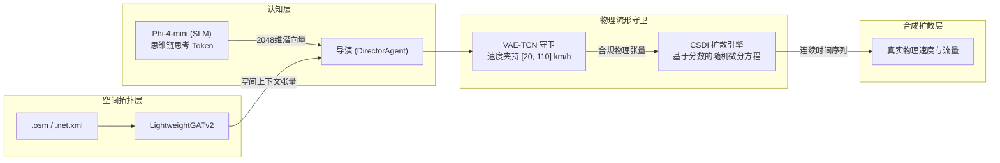

# 🧠 生成式 AI、物理流形守卫与扩散过程

本文档详尽阐明驱动 **SYNTHETIC** 系统的深度学习神经网络架构与数学建模公式：包括端侧小语言模型 Phi-4-mini、VAE-TCN 物理守卫、基于分数的条件扩散模型 (CSDI) 以及 Optuna 即时自动化机器学习 (AutoML)。

⬅️ [文档中心](README.md) | 🏛️ [系统架构规范](architecture.md) | 📡 [多模态生成器](multimodal_generators.md) | 🗺️ [空间拓扑](spatial_and_environment.md)

---

## 1. 混合生成式架构工作流

---

## 2. 认知层：编剧智能体 (`src/agents/screenwriter.py`)

**ScreenwriterAgent** 基于微软 **Phi-4-mini** 开源推理模型（以 GGUF 格式通过 `llama-cpp-python` 本地部署）。模型开启 `<think>...</think>` 深度思考模式，推理天气恶化对路网通行能力与事故概率的因果影响。最终层隐状态被汇聚投影为 **2048 维连续潜空间向量**：
$$\mathbf{z}_{dream} \in \mathbb{R}^{2048}$$

---

## 3. 物理流形守卫：VAE-TCN (`src/models/vae_tcn.py`)

变分自编码器结合一维因果空洞卷积 (TCN) 构成神经-符号混合安全防火墙：
* **包含物理惩罚项的损失函数：**
  $$\mathcal{L} = \mathcal{L}_{recon} + \beta \mathcal{D}_{KL}(q_\phi(\mathbf{z}|\mathbf{x}) \parallel p(\mathbf{z})) + \lambda_{phys} \mathcal{L}_{physics}$$
  严格约束自由流车速 $v \in [20, 110]\text{ km/h}$，并惩罚超常加速度。
* **时间惯性平滑：** 引入 30% 前一日状态记忆，消除跨日突变：
  $$\mathbf{z}_{有效}^{(t)} = 0{,}70 \cdot \mathbf{z}_{dream}^{(t)} + 0{,}30 \cdot \mathbf{z}_{有效}^{(t-1)}$$

---

## 4. 基于分数的条件扩散：CSDI (`src/models/csdi_engine.py`)

采用连续分数匹配扩散模型逆向去噪生成每秒高频速度与流量序列。系统在跨日计算中引入 `seed_tail` 历史缓冲区，确保午夜 00:00:00 前后时间序列绝对连续。

---

## 5. Optuna 即时 AutoML 自适应调优 (`src/optimizer/tuner.py`)

当 VAE-TCN 捕获极端未见异常情境（异常度 $> 1.00$）时，系统在后台自启动 Optuna 贝叶斯搜索，在数秒内完成 TCN 与 CSDI 架构自适应，不造成前端 UI 卡顿。

---

   
  <b>Noxfort Systems</b> — <i>A State Of Art Company</i>

