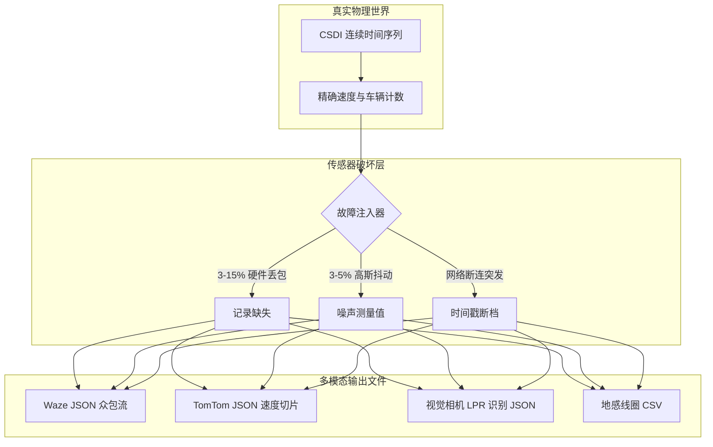

# 📡 多模态数据生成器与传感器破坏层

本文档规定 **SYNTHETIC** 平台支持的全部输出格式规范、故障注入机制以及多模态文件在磁盘上的组织层级。

⬅️ [文档中心](README.md) | 🏛️ [系统架构规范](architecture.md) | 🧠 [生成式 AI 与物理护卫](generative_ai_and_physics.md) | 🗺️ [空间拓扑](spatial_and_environment.md)

---

## 1. 物理规律与感知破坏的单一职责

---

## 2. 生成器规范

* **Waze 众包流 (`src/globalf/waze_generator.py`)：** 仿真 GPS 移动端拥堵警报、事故反馈与道路延误，输出为 JSON 格式 (`waze_feed_*.json`)。
* **TomTom 道路流 (`src/globalf/tomtom_generator.py`)：** 仿真商用车队遥测数据、功能道路等级 (FRC1–FRC6) 及平均行驶时间，输出为 JSON 格式 (`tomtom_flow_*.json`)。
* **视觉识别相机 (`src/localf/camera_generator.py`)：** 仿真道路电警抓拍设备，包含合成车牌号码、识别置信度、车道号及瞬时速度，输出为 JSON 格式 (`cam_*_*.json`)。
* **地感线圈检测器 (`src/localf/loop_generator.py`)：** 仿真埋设于沥青路面下的电磁环形线圈（分车道车流量与时间占有率），输出为 CSV 格式 (`loop_*_*.csv`)。

---

## 3. 故障注入与现实噪声模拟

1. **硬件丢包 (3% 至 15%)：** 模拟移动基站切换与有线交换机数据包丢失。
2. **断档突发：** 模拟供电中断造成的连续数分钟数据真空。
3. **高斯传感器抖动 (3% 至 5%)：** 
   $$v_{观测} = v_{实际} \cdot \left(1 + \mathcal{N}\left(0, \sigma^2\right)\right), \quad \sigma \in [0{,}03; 0{,}05]$$

---

   
  <b>Noxfort Systems</b> — <i>A State Of Art Company</i>

