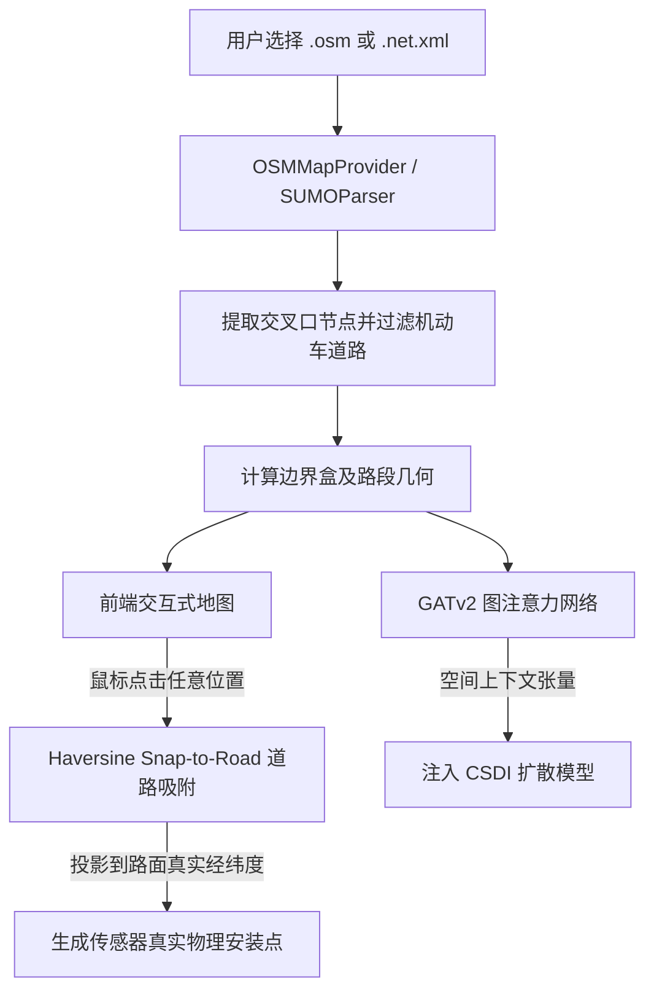

# 🗺️ 空间拓扑与马尔可夫气象环境物理引擎

本文档阐述 **SYNTHETIC** 平台的真实地理路网解析体系、Haversine 道路路面正交吸附投影机制以及马尔可夫气象状态机。

⬅️ [文档中心](README.md) | 🏛️ [系统架构规范](architecture.md) | 🧠 [生成式 AI 与物理护卫](generative_ai_and_physics.md) | 🖥️ [桌面界面](ui_and_localization.md)

---

## 1. 真实地理空间感知架构

SYNTHETIC 拒绝脱离实际地图的虚拟几何生成，所有仿真数据均严格锚定于真实城市路网：

---

## 2. 数学 "Snap-to-Road" 道路正交投影吸附算法

用户在屏幕界面点击部署线圈或摄像头时难以达到米级精度。系统计算点击坐标 $(\phi_{click}, \lambda_{click})$ 与所有有效道路线段的大圆航线距离（Haversine 公式）：

$$d = 2R \arcsin \left( \sqrt{\sin^2\left(\frac{\Delta \phi}{2}\right) + \cos(\phi_1)\cos(\phi_2)\sin^2\left(\frac{\Delta \lambda}{2}\right)} \right)$$

投影算法求解正交垂足，将坐标强制平移吸附到沥青路面上，防止传感器出现于建筑物或河流中。

---

## 3. 马尔可夫链气象演化 (`config/weather_rules.json`)

天气变化遵循离散马尔可夫链状态机：
* 晴天 $\to$ 多云 $\to$ 阴天 $\to$ 中雨 $\to$ 暴雨雷击 $\to$ 雨渐止。
* 输出三元语义描述 `(天气状态, 严重程度, 物理特征)`（例如：*“暴雨，路面严重积水且附着系数急剧下降”*），并将其输入 Phi-4-mini 模型提示词中引导潜向量。

---

## 4. 时间统一原点：Ground Zero 周期对齐

所有生成的周计划仿真数据均自动锚定在**紧邻的下周一凌晨 00:00:00**，确保完美覆盖工作日早晚高峰与周末平峰的完整周期。

---

   
  <b>Noxfort Systems</b> — <i>A State Of Art Company</i>

